<a name="readme-topo"></a>

<h1 align='center'>
  📊 PROBLEMA 2 - Cálculo e Análise do Nível Máximo

</h1>

<div align='center'>

[![SO][Ubuntu-badge]][Ubuntu-url]
[![IDE][vscode-badge]][vscode-url]
[![Make][make-badge]][make-url]
[![Linguagem][cpp-badge]][cpp-url]

Algoritmos e Estruturas de Dados II <br>
Engenharia de Computação <br>
Prof. Michel Pires da Silva <br>
CEFET-MG Campus V <br>
2024/2
</div>

<details>
  <summary>
    <b style='font-size: 15px'>
      📑 Sumário
    </b>
  </summary>
  <ol>
    <li><a href="#-introdução">🔍 Introdução</a></li>
    <li>
      <a href="#-objetivos">🎯 Objetivos</a>
      <ul>
        <li><a href="#objetivo-geral">Objetivo Geral</a></li>
        <li><a href="#objetivos-específicos">Objetivos Específicos</a></li>
      </ul>
    </li>
    <li>
      <a href="#-modelagem-de-aplicação">🔬 Modelagem de Aplicação</a>
      <ul>
        <li><a href="#menu-interativo">Menu Interativo</a></li>
        <li><a href="#inserção-de-valores">Inserção de Valores</a></li>
        <li><a href="#remoção-de-valores">Remoção de Valores</a></li>
        <li><a href="#leitura-dos-dados">Leitura dos Dados</a></li>
        <li><a href="#visualização-da-altura-e-estrutura">Visualização da Altura e Estrutura</a></li>
        <li><a href="#altura-máxima-da-árvore">Altura Máxima da Árvore</a></li>
        <li><a href="#sugestão-de-rotações">Sugestão de Rotações</a></li>
        <li><a href="#caminho-mais-longo">Caminho Mais Longo</a></li>
        <li>
          <a href="#análise-de-crescimento">Análise de Crescimento</a>
          <ul>
            <li><a href="#árvores-tortas">Árvores Tortas</a></li>
            <li><a href="#árvores-quase-equilibradas">Árvores Quase Equilibradas</a></li>
            <li><a href="#alterações-no-processo-de-geração-da-árvore-quase-equilibrada">Alterações no Processo de Geração da Árvore Quase Equilibrada</a></li>
            <li><a href="#comparação-de-desempenho">Comparação de Desempenho</a></li>
            <li><a href="#exportação-dos-resultados-e-geração-de-gráficos">Exportação dos Resultados e Geração de Gráficos</a></li>
          </ul>
        </li>
      </ul>
    </li>
    <li>
      <a href="#%EF%B8%8F-metodologia">🗳️ Metodologia</a>
      <ul>
        <li><a href="#-arquivos">Arquivos</a></li>
        <li><a href="#-estrutura-do-projeto">Estrutura do Projeto</a></li>
        <li><a href="#-bibliotecas">Bibliotecas</a></li>
        <li>
          <a href="#definições-e-estruturas-usadas">Definições e Estruturas Usadas</a>
          <ul>
            <li><a href="#arquivo-problema2hpp">Arquivo problema2.hpp</a></li>
          </ul>
        </li>
        <li>
          <a href="#-funções-implementadas">Funções Implementadas</a>
          <ul>
            <li><a href="#arquivo-maincpp">Arquivo main.cpp</a></li>
            <li><a href="#arquivo-problema2cpp">Arquivo problema2.cpp</a></li>
            <li><a href="#arquivo-plotpy">Arquivo plot.py</a></li>
          </ul>
        </li>
      </ul>
    </li>
    <li>
      <a href="#-testes-e-resultados">📊 Testes e Resultados</a>
      <ul>
        <li>
          <a href="#testes">Testes</a>
          <ul>
            <li><a href="#inserção-de-dados">Inserção de Dados</a></li>
            <li><a href="#remoção-de-dados">Remoção de Dados</a></li>
            <li><a href="#exibição-do-nível-máximo">Exibição do Nível Máximo</a></li>
            <li><a href="#sugestão-de-rotações">Sugestão de Rotações</a></li>
            <li><a href="#exibição-do-caminho-máximo">Exibição do Caminho Máximo</a></li>
          </ul>          
        </li>
        <li>
          <a href="#-análise-de-resultados">Análise de Resultados</a>
          <ul>
            <li>
              <a href="#análise-de-crescimento">Análise de Crescimento</a>
              <ul>
                <li><a href="#testes-realizados">Testes Realizados</a></li>
                <li><a href="#comportamento-logarítmico">Comportamento Logarítmico</a></li>
                <li>
                  <a href="#depreciação-de-altura-entre-árvores">Depreciação de Altura entre Árvores</a>
                  <ul>
                    <li><a href="#comportamento-da-depreciação">Comportamento da Depreciação</a></li>
                  </ul>                  
                </li>
              </ul>
            </li>
          </ul>
        </li>
      </ul>
    </li>
    <li><a href="#-conclusão">🏁 Conclusão</a></li>
    <li>
      <a href="#-começando">🔨 Começando</a>
      <ul>
        <li><a href="#pré-requisitos">Pré-requisitos</a></li>
        <li><a href="#instalando">Instalando</a></li>
      </ul>
    </li>
    <li><a href="#-ambiente-de-compilação-e-execução">🧪 Ambiente de Compilação e Execução</a></li>
    <li><a href="#-contato">📨 Contato</a></li>
    <li><a href="#-referências">📚 Referências</a></li>
  </ol>
</details>


<details> 
  <summary>
    <b style='font-size: 12px'> Abstract </b> 
  </summary>
  O **Problema 2** propõe o estudo e a implementação de algoritmos relacionados ao cálculo do nível máximo de árvores binárias, incluindo a análise de suas propriedades estruturais e o impacto de operações como inserção e remoção. O nível máximo, que determina a profundidade da folha mais distante da raiz, é uma métrica fundamental para entender a eficiência e o balanceamento de árvores binárias. Além disso, o problema inclui desafios adicionais, como a análise de crescimento, identificação do caminho mais longo e sugestões de rotações para balanceamento, proporcionando uma abordagem abrangente para explorar o comportamento das árvores binárias em diferentes cenários.


  🔑 <b>Keywords:</b> Árvores Binárias, Nível Máximo, Estruturas de Dados, Inserção e Remoção, Análise de Crescimento, Balanceamento, Caminho Mais Longo, Rotações.

<br>
</details>

## 🔍 Introdução

<div align='justify'>

  
Este [trabalho][trabalho-url] tem como base o **Problema 2** da lista de exercícios de **Árvores Binárias e AVL**, proposto na disciplina de **Algoritmos e Estruturas de Dados II**. O objetivo principal é explorar a profundidade estrutural das árvores binárias através do cálculo do nível máximo, permitindo uma melhor compreensão da eficiência e do impacto do balanceamento em operações fundamentais como inserção e remoção. 

O nível máximo, também conhecido como altura da árvore, é a distância da raiz até a folha mais profunda, sendo uma métrica importante para avaliar o desempenho e a estabilidade de algoritmos que utilizam árvores como estrutura de dados. Além disso, este trabalho busca integrar conceitos de visualização interativa, análise de crescimento e sugestão de rotações, possibilitando que o comportamento das árvores seja analisado de forma mais dinâmica e abrangente.

Por fim, o **Problema 2** também introduz um desafio adicional, que consiste em sugerir rotações ou reorganizações para balancear a árvore com base no nível máximo calculado, abordando aspectos práticos e teóricos do balanceamento em árvores binárias. Este trabalho não apenas reforça conceitos fundamentais de estruturas de dados, mas também permite o desenvolvimento de habilidades analíticas e de implementação em situações práticas.

</div>

<p align="right">(<a href="#readme-topo">voltar ao topo</a>)</p>


## 🎯 Objetivos

<div align="justify">

### Objetivo Geral

O objetivo geral deste trabalho é explorar e implementar algoritmos e técnicas de análise estrutural de árvores binárias, com foco no cálculo do nível máximo, visualização interativa, análise de crescimento e sugestões de balanceamento, utilizando conceitos aprendidos na disciplina de **Algoritmos e Estruturas de Dados II**.


### Objetivos Específicos


- Implementar uma função para calcular o nível máximo de uma árvore binária e analisar sua profundidade em diferentes cenários.
- Fornecer uma visualização interativa que permita ao usuário observar mudanças no nível máximo após inserções e remoções de nós.
- Comparar o crescimento e a profundidade de árvores desbalanceadas e balanceadas, explorando diferentes conjuntos de inserções.
- Identificar o caminho mais longo da raiz até uma folha, permitindo análises sobre o impacto do desbalanceamento.
- Desenvolver uma abordagem para sugerir rotações ou reorganizações que poderiam tornar a árvore balanceada com base no nível máximo calculado.
- Consolidar conceitos de balanceamento e eficiência em árvores binárias e AVL por meio de uma aplicação prática.


</div>

<p align="right">(<a href="#readme-topo">voltar ao topo</a>)</p>

## 🔬 Modelagem de Aplicação

<div align="justify">

A solução para o **Problema 2** foi desenvolvida de maneira modular, permitindo a interação do usuário com a árvore binária por meio de um menu interativo. A partir dos conceitos aprendidos sobre árvores binárias e AVL, a implementação deste problema foi estruturada para abordar desafios práticos e teóricos relacionados à profundidade, desbalanceamento e reorganização de árvores. A seguir, detalharemos os principais aspectos da modelagem da aplicação:

### Menu Interativo
A interação com a aplicação é realizada por meio de um menu intuitivo, implementado na função [`menuInterativo`](src/main.cpp). O menu oferece as seguintes opções:
1. Inserir nós.
2. Remover nós.
3. Exibir a altura atual da árvore.
4. Sugerir rotações para balanceamento.
5. Mostrar o caminho mais longo.
6. Realizar uma análise de crescimento.
7. Sair do programa.

### Inserção de Valores
A inserção de valores na árvore binária é feita de maneira iterativa. Para cada valor fornecido, a função [`inserirNo`](src/problema2.cpp) é chamada, garantindo a adição do elemento na posição correta, de acordo com as propriedades da árvore binária de busca. 

### Remoção de Valores
A remoção de valores segue uma abordagem similar à inserção, sendo feita para cada valor informado pelo usuário. A função [`removerNo`](src/problema2.cpp) lida com casos especiais, como nós com um único filho ou folhas, garantindo que a estrutura da árvore seja mantida.

### Leitura dos Dados
Os dados fornecidos pelo usuário são capturados utilizando a função [`multiplasEntradas`](src/problema2.cpp), permitindo a entrada de valores separados por vírgulas. Isso possibilita operações em lote, como inserir ou remover múltiplos valores de uma só vez. A entrada é validada, e mensagens de erro são exibidas caso haja valores inválidos.

### Visualização da Altura e Estrutura
Após cada operação de inserção ou remoção, a altura atual da árvore é exibida, e sua estrutura é mostrada ao usuário. Esse recurso auxilia na compreensão do impacto de cada modificação realizada. Para facilitar a visualização da árvore pelo usuário, a função [`prettyPrintTree`](src/problema2.cpp) exibe os nós hierarquicamente, indicando os filhos esquerdo e direito de cada nó.

### Altura Máxima da Árvore

A aplicação inclui a funcionalidade de **encontrar a altura máxima da árvore**, que representa o comprimento do caminho mais longo da raiz até um nó folha. Esse cálculo é fundamental para analisar o balanceamento e a eficiência de operações na árvore.

A função responsável por calcular a altura máxima é [`encontrarAlturaMaxima`](src/problema2.cpp), que utiliza um algoritmo recursivo para percorrer a árvore e determinar sua profundidade.

1. **Definição Base**:
   - Se a árvore estiver vazia, a altura é definida como `0`.
   - Caso contrário, a função é chamada recursivamente para os nós esquerdo e direito.

2. **Recursão**:
   - Para cada nó, a função calcula a altura máxima de suas subárvores esquerda e direita.
   - A altura do nó atual é definida como o maior valor entre as alturas das subárvores, incrementado em `1`.

3. **Resultado Final**:
   - Após visitar todos os nós, a função retorna a altura máxima da árvore, que é exibida ao usuário.

Considere a seguinte árvore binária:

```
        10
       /  \
      5    15
     / \  
    3   7 
```

1. A função começa na raiz (`10`) e recorre aos filhos esquerdo (`5`) e direito (`15`).
2. No ramo esquerdo, a subárvore com raiz em `5` é avaliada, onde as alturas de `3` e `7` são `1`.
3. A altura do nó `5` é calculada como `max(1, 1) + 1 = 2`.
4. No ramo direito, o nó `15` é uma folha, resultando em altura `1`.
5. A altura máxima da árvore é então `max(2, 1) + 1 = 3`.

O cálculo da altura máxima é essencial para:
- Avaliar o balanceamento de árvores AVL, onde a diferença de altura entre as subárvores deve ser no máximo `1`.
- Analisar a eficiência de buscas e inserções, já que o desempenho dessas operações depende diretamente da altura da árvore.
### Sugestão de Rotações

A função [`sugerirRotacoes`](src/problema2.cpp) é responsável por analisar o balanceamento da árvore binária e, se necessário, sugerir ou aplicar rotações para corrigir possíveis desbalanceamentos. A implementação considera dois cenários principais de desbalanceamento: para a esquerda e para a direita, indicando ao usuário qual rotação é mais adequada para cada caso.

A função utiliza as alturas das subárvores para determinar se um nó está desbalanceado:
1. **Desbalanceamento para a Esquerda**: O nó possui um desnível à esquerda, identificado quando a diferença entre a altura da subárvore esquerda e a direita é igual a 2:
   - Se o desbalanceamento for causado pela subárvore esquerda do nó esquerdo, a rotação sugerida é **uma rotação simples à direita**.
   - Caso contrário, se o desbalanceamento for causado pela subárvore direita do nó esquerdo, a sugestão será uma **rotação dupla esquerda-direita**.
   
2. **Desbalanceamento para a Direita**: O nó possui um desnível à direita, identificado quando a diferença entre a altura da subárvore direita e a esquerda é igual a 2:
   - Se o desbalanceamento for causado pela subárvore direita do nó direito, a rotação sugerida é **uma rotação simples à esquerda**.
   - Caso contrário, se o desbalanceamento for causado pela subárvore esquerda do nó direito, a sugestão será uma **rotação dupla direita-esquerda**.

A função `sugerirRotacoes` é projetada para ter os seguintes parâmetros:
- `root`: Raiz da árvore ou subárvore a ser analisada.
- `aux`: Contador de rotações realizadas ou sugeridas.
- `balancear`: Um `bool` que define se a função deve apenas sugerir rotações ou também aplicá-las diretamente.
- `printar`: Um `bool` que indica se as mensagens explicando as rotações devem ser exibidas ao usuário.

A função faz uso das seguintes operações auxiliares para realizar os ajustes:
- **`rotacaoDireita`**: Realiza uma rotação simples à direita em um nó desbalanceado, deslocando sua subárvore esquerda para a posição do nó.
- **`rotacaoEsquerda`**: Realiza uma rotação simples à esquerda, deslocando sua subárvore direita para a posição do nó.

Essa abordagem promove o balanceamento eficiente da árvore, seja por meio de sugestões ao usuário ou pela aplicação automática das rotações, facilitando a visualização e manipulação da estrutura.


### Caminho Mais Longo
A aplicação permite que o usuário visualize o **caminho mais longo** da raiz até um nó folha. Essa funcionalidade é implementada na função [`mostrarCaminhoMaisLongo`](src/problema2.cpp). Para identificar o caminho mais longo, a função utiliza uma abordagem recursiva que percorre a árvore em profundidade, acumulando os nós visitados.

1. **Recursão**:
   - A função inicia na raiz da árvore e, para cada nó, recursivamente percorre os filhos esquerdo e direito.
   - Para cada ramo da árvore, ela calcula o comprimento do caminho.

2. **Comparação de Altura**:
   - Em cada passo, os caminhos das subárvores esquerda e direita são comparados.
   - O caminho mais longo entre os dois é selecionado.

3. **Acumulação de Nós**:
   - À medida que a função recorre à árvore, os valores dos nós visitados no caminho atual são armazenados em uma estrutura, como um vetor (`std::vector<int>`).

4. **Resultado**:
   - Após visitar todos os nós, o caminho mais longo é retornado e exibido ao usuário como uma sequência de valores.

Considere a seguinte árvore binária:

```
        10
       /  \
      5    15
     / \  
    3   7 
```

1. A função começa na raiz (`10`) e calcula o comprimento do caminho para os filhos esquerdo (`5`) e direito (`15`).
2. No ramo esquerdo (`5`), ela continua para os nós `3` e `7`, identificando o caminho mais longo como `10 -> 5 -> 3`.
3. Comparando com o ramo direito (`10 -> 15`), o caminho mais longo é determinado como `10 -> 5 -> 3`.

Este recurso é útil para identificar possíveis desbalanceamentos na árvore e compreender sua profundidade estrutural.
### Análise de Crescimento

A função [`analiseDeCrescimento`](src/problema2.cpp) foi implementada para comparar o desempenho de árvores tortas (totalmente desbalanceadas) com árvores quase equilibradas, avaliando como o balanceamento impacta a altura da árvore e o custo de operações como busca, inserção e remoção.

#### Árvores Tortas

As árvores tortas são geradas pela função [`gerarArvoreTorta`](src/problema2.cpp). Essa árvore é criada inserindo os elementos em ordem crescente, o que resulta em uma árvore completamente desbalanceada, onde todos os nós são inseridos como filhos à direita de seus pais.

- **Exemplo**: Para `m = 5`, a árvore gerada seria:

```
        1
         \
          2
           \
            3
             \
              4
               \
                5
```


Este tipo de árvore maximiza a altura, pois cada novo nó é inserido como filho direito, criando uma estrutura linear.

#### Árvores Quase Equilibradas

As árvores quase equilibradas são geradas pela função [`gerarArvoreQseEquilibrada`](src/problema2.cpp). Nesse caso, os elementos são inseridos de forma crescente, mas antes de cada inserção, é verificada a diferença entre a altura máxima e mínima da árvore. Caso essa diferença ultrapasse um limite pré-definido (calculado com base em `m`), a função [`sugerirRotacoes`](src/problema2.cpp) aplica as rotações necessárias, equilibrando a árvore.

#### Alterações no Processo de Geração da Árvore Quase Equilibrada

A função `gerarArvoreQseEquilibrada` foi ajustada para verificar o desequilíbrio **apenas até `m/2`**. Isso significa que o balanceamento da árvore ocorre durante a primeira metade da inserção dos nós. Durante esse processo, se a diferença entre a altura máxima e mínima da árvore exceder o limite `n`, a função aplica as rotações necessárias. Após `m/2`, o balanceamento não é mais verificado, permitindo que a árvore seja balanceada de forma gradual.

Essa abordagem tem como objetivo:
1. **Evitar rotações excessivas** no início, quando a árvore ainda está em sua forma mais "torta".
2. **Controlar o nível de balanceamento** de forma mais eficiente ao longo do processo de inserção, limitando o número de rotações realizadas, mas ainda garantindo que a árvore não se torne excessivamente desbalanceada.

O parâmetro `n` é calculado a partir do número de nós `m`:

$$ n = \frac{m}{3} $$

Aqui, `m` é o número de nós da árvore. O valor de `n` foi ajustado para ser mais simples e reflete uma abordagem mais tolerante ao desequilíbrio. Essa constante ajusta o nível de balanceamento, permitindo uma árvore que não seja completamente balanceada (como uma árvore AVL), mas que ainda simule um comportamento razoavelmente equilibrado, com uma tolerância ao desbalanceamento.

- **Exemplo**: Para `m = 10`, o valor de `n` será `3`.
- Para `m = 100`, o valor de `n` será `33`.

#### Comparação de Desempenho

A função `analiseDeCrescimento` compara as alturas das árvores tortas e quase equilibradas e calcula a **depreciação** da altura devido ao balanceamento, utilizando a fórmula:

$$ \text{Depreciação} = \left( \frac{\text{Altura Torta} - \text{Altura Equilibrada}}{\text{Altura Torta}} \right) \times 100 $$

Ou seja, a depreciação mede quanto a altura de uma árvore torta é reduzida quando ela é balanceada (com as rotações aplicadas). A análise é feita para diferentes valores de `m`, que variam de 3 a 10.000, e os resultados são armazenados em um vetor de pares para análise posterior.

#### Exportação dos Resultados e Geração de Gráficos

Os resultados da comparação são exibidos no console e também exportados para um arquivo CSV em [`datasets/analise.csv`](datasets/analise.csv) através da função [`salvarArquivo`](src/problema2.cpp).

Além disso, um script Python ([`plot.py`](src/plot.py)) é executado para gerar gráficos a partir desses dados, ilustrando claramente a diferença de altura entre as árvores tortas e quase equilibradas. Isso permite visualizar o impacto do balanceamento na estrutura da árvore, e consequentemente, no desempenho de operações como busca e inserção.

A análise de crescimento demonstra de forma clara como o balanceamento das árvores influencia diretamente na altura das estruturas. As árvores tortas, ao crescerem, acabam se tornando ineficientes devido à sua altura excessiva, o que aumenta o custo de operações. Já as árvores quase equilibradas, mesmo com um leve desequilíbrio controlado, mantêm um desempenho mais eficiente.

O gráfico gerado pelo script Python ajuda a visualizar o impacto das rotações e do balanceamento no desempenho das árvores, proporcionando uma comparação eficiente entre os dois tipos de árvores para diferentes tamanhos de entrada.

</div>

<p align="right">(<a href="#readme-topo">voltar ao topo</a>)</p>

## 🗳️ Metodologia

<div align="justify">

O projeto foi desenvolvido em **C++** utilizando a IDE **Visual Studio Code** para o desenvolvimento do código-fonte e organização modular dos arquivos. Ele faz uso de um menu interativo para facilitar a interação do usuário com as árvores binárias de busca. Além disso, foi utilizado o **Python** para gerar visualizações gráficas baseadas nos dados obtidos durante a análise de crescimento.

### 📁 Arquivos

O projeto está estruturado no diretório principal, contendo subdiretórios para armazenar os arquivos de código-fonte, os datasets e os gráficos gerados. A seguir, estão descritos os arquivos principais e suas responsabilidades:

- **[main.cpp](src/main.cpp)**: Arquivo principal que implementa o menu interativo, permitindo ao usuário realizar operações de inserção, remoção, análise de crescimento e sugestão de rotações em árvores binárias.
- **[problema2.hpp](src/problema2.hpp)** e **[problema2.cpp](src/problema2.cpp)**: Contêm as definições e implementações das funções auxiliares para manipulação de árvores binárias, incluindo análise de crescimento, sugestão de rotações e exibição do caminho mais longo.
- **[plot.py](src/plot.py)**: Script Python responsável por gerar gráficos baseados nos dados de crescimento armazenados no arquivo [`datasets/analise.csv`](datasets/analise.csv).
- **[makefile](makefile)**: Arquivo de automação que define as regras para compilar o projeto.
- **[make.sh](make.sh)**: Script de compilação que executa o `makefile` e gera o executável `app`.

### 📂 Estrutura do Projeto

A estrutura do projeto foi organizada de forma a separar os arquivos por funcionalidades, mantendo o código modular e fácil de expandir. A seguir, está a hierarquia dos arquivos e diretórios:

  ```.
  .
  ├── datasets
  │   ├── analise.csv          
  │   └── graphs             
  │       └── analiseDeCrescimento.png
  ├── src
  │   ├── main.cpp             
  │   ├── problema2.cpp       
  │   ├── problema2.hpp       
  │   └── plot.py    
  ├── make.sh        
  ├── makefile                 
  └── README.md              
  ```

### 📚 Bibliotecas

O projeto utiliza bibliotecas da **STL (Standard Template Library)** do C++, que fornecem funcionalidades como vetores, strings, algoritmos e manipulação de arquivos. Além disso, no script Python, foram usadas bibliotecas para visualização gráfica e ajuste de curvas.

#### Bibliotecas em C++

- **[iostream](https://www.cplusplus.com/reference/iostream/)**: Para operações de entrada e saída.
- **[vector](https://www.cplusplus.com/reference/vector/)**: Para manipulação de vetores dinâmicos.
- **[string](https://www.cplusplus.com/reference/string/)**: Para manipulação de strings.
- **[fstream](https://www.cplusplus.com/reference/fstream/)**: Para manipulação de arquivos.
- **[cmath](https://www.cplusplus.com/reference/cmath/)**: Para cálculos matemáticos, como logaritmos.
- **[algorithm](https://www.cplusplus.com/reference/algorithm/)**: Para algoritmos padrão.

#### Bibliotecas em Python

- **[pandas](https://pandas.pydata.org/)**: Para manipulação de dados no arquivo CSV.
- **[matplotlib](https://matplotlib.org/)**: Para geração de gráficos.
- **[numpy](https://numpy.org/)**: Para cálculos matemáticos e ajuste de curvas.
- **[scipy](https://scipy.org/)**: Para ajuste de regressão logarítmica.

Essa estrutura modular e o uso de bibliotecas otimizam o desenvolvimento, tornam o código mais legível e permitem a fácil integração de novos recursos.


</div>

<p align="right">(<a href="#readme-topo">voltar ao topo</a>)</p>

### Definições e Estruturas Usadas

<div align="justify">

Para a implementação do problema, utilizamos o arquivo de cabeçalho `problema2.hpp`, que organiza as principais funções e estruturas necessárias para manipulação e análise das árvores. Este arquivo fornece suporte à modularidade do código, promovendo a reutilização e a separação lógica de responsabilidades. Abaixo, são detalhadas as definições e estruturas presentes no arquivo de cabeçalho.

#### Arquivo [problema2.hpp](src/problema2.hpp)

O arquivo `problema2.hpp` define funções auxiliares, estruturas de dados e algoritmos que são essenciais para as operações no contexto das árvores binárias. Não há classes, mas funções e estruturas que tratam diretamente da manipulação de árvores por meio de nós básicos.

- **[`struct Node`](src/problema2.hpp)**: Estrutura que define um nó de uma árvore binária:
  - **`int data;`**: Representa o valor armazenado no nó.
  - **`Node* left;`**: Ponteiro para o filho esquerdo do nó.
  - **`Node* right;`**: Ponteiro para o filho direito do nó.

- **Funções Públicas**:
  - **[`Node* inserirNo(Node* root, int valor)`](src/problema2.hpp)**:
    - Insere um valor na árvore binária.
    - Garante que a árvore permanece uma estrutura de busca válida.
  - **[`Node* removerNo(Node* root, int valor)`](src/problema2.hpp)**:
    - Remove um valor específico da árvore binária.
    - Lida com os três casos de remoção em árvores binárias:
      1. Nó folha.
      2. Nó com um filho.
      3. Nó com dois filhos (substituição pelo nó mínimo da subárvore direita).
  - **[`int calcularAltura(Node* root)`](src/problema2.hpp)**:
    - Calcula a altura da árvore.
    - Retorna a maior profundidade entre o nó raiz e seus descendentes.
  - **[`int calcularMenorAltura(Node* root)`](src/problema2.hpp)**:
    - Calcula a menor altura da árvore.
    - Útil para análises de balanceamento.
  - **[`void sugerirRotacoes(Node*& root, int& aux, bool balancear, bool printar)`](src/problema2.hpp)**:
    - Analisa o balanceamento da árvore e sugere rotações para corrigir desbalanceamentos.
    - Pode aplicar rotações (se habilitado) e fornece feedback visual ao usuário.
  - **[`Node* rotacaoDireita(Node* nó)`](src/problema2.hpp)**:
    - Realiza uma rotação simples à direita para corrigir desbalanceamento.
  - **[`Node* rotacaoEsquerda(Node* nó)`](src/problema2.hpp)**:
    - Realiza uma rotação simples à esquerda para corrigir desbalanceamento.
  - **[`void mostrarCaminhoMaisLongo(Node* root)`](src/problema2.hpp)**:
    - Identifica e exibe o caminho mais longo de um nó raiz até uma folha.
  - **[`void prettyPrintTree(Node* root)`](src/problema2.hpp)**:
    - Exibe a árvore de forma hierárquica com conectores visuais, facilitando a visualização do usuário.
  - **[`std::vector<int> multiplasEntradas()`](src/problema2.hpp)**:
    - Lê múltiplos valores de entrada do usuário, separados por vírgulas, e retorna um vetor de inteiros.
  - **[`Node* gerarArvoreTorta(int m)`](src/problema2.hpp)**:
    - Gera uma árvore "torta", inserindo valores em ordem crescente.
    - Útil para análise de cenários desbalanceados.
  - **[`Node* gerarArvoreQseEquilibrada(int m, int n)`](src/problema2.hpp)**:
    - Gera uma árvore quase equilibrada, utilizando rotações para ajustar o balanceamento após inserções.
    - `m`: Número total de nós na árvore.
    - `n`: Diferença máxima permitida entre altura máxima e mínima.
  - **[`void analiseDeCrescimento()`](src/problema2.hpp)**:
    - Realiza uma análise de crescimento comparando árvores desbalanceadas e equilibradas.
    - Salva os resultados em um arquivo CSV e plota gráficos.

</div>

<p align="right">(<a href="#readme-topo">voltar ao topo</a>)</p>


### 📝 Funções Implementadas

<div align="justify">

As funções implementadas no projeto são responsáveis por realizar a manipulação das árvores binárias, incluindo inserção, remoção, cálculos de altura, sugestões de rotações e análises comparativas. A seguir, são apresentadas as funções implementadas no projeto, organizadas por arquivo fonte.

</div>

#### Arquivo [main.cpp](src/main.cpp)

O arquivo principal `main.cpp` é responsável por inicializar o programa e gerenciar o fluxo de execução por meio de um menu interativo. Ele utiliza as funções implementadas no arquivo `problema2.hpp` para realizar operações nas árvores.

- **Método [`main()`](src/main.cpp)**:
  1. Exibe um menu para o usuário com opções relacionadas às operações nas árvores.
  2. Permite ao usuário inserir, remover valores, verificar balanceamento e realizar análises de crescimento.
  3. Utiliza as funções do arquivo `problema2.hpp` para manipular as árvores de forma eficiente.
  4. Finaliza o programa quando o usuário opta por sair.

#### Arquivo [problema2.cpp](src/problema2.cpp)

O arquivo `problema2.cpp` contém as implementações das funções declaradas em `problema2.hpp`. Ele é responsável por gerenciar as operações e análises relacionadas às árvores binárias.

- **Método [`Node::Node(int valor)`](src/problema2.cpp)**:
  - Construtor da estrutura `Node`, que inicializa um nó com um valor específico.

- **Método [`Node* inserirNo(Node* root, int valor)`](src/problema2.cpp)**:
  - Insere um valor na árvore binária de busca, garantindo que ela permaneça ordenada.
  - Retorna o nó raiz atualizado após a inserção.

- **Método [`Node* removerNo(Node* root, int valor)`](src/problema2.cpp)**:
  - Remove um valor específico da árvore binária.
  - Lida com os três casos clássicos de remoção:
    1. Nó folha.
    2. Nó com um filho.
    3. Nó com dois filhos (substituição pelo menor valor na subárvore direita).

- **Método [`Node* encontrarMinimo(Node* root)`](src/problema2.cpp)**:
  - Encontra o nó com o menor valor na árvore, percorrendo a subárvore esquerda.

- **Método [`int calcularAltura(Node* root)`](src/problema2.cpp)**:
  - Calcula a altura máxima de uma árvore binária, retornando a profundidade do nó mais distante da raiz.

- **Método [`int calcularMenorAltura(Node* root)`](src/problema2.cpp)**:
  - Calcula a menor altura de uma árvore binária, retornando a profundidade do caminho mais curto da raiz até uma folha.

- **Método [`void sugerirRotacoes(Node*& root, int& aux, bool balancear, bool printar)`](src/problema2.cpp)**:
  - Analisa o balanceamento da árvore e sugere rotações (simples ou duplas) para corrigir desbalanceamentos.
  - Pode aplicar as rotações automaticamente e imprime informações sobre o processo.

- **Método [`Node* rotacaoDireita(Node* nó)`](src/problema2.cpp)**:
  - Realiza uma rotação simples à direita, ajustando a árvore para corrigir desbalanceamentos.

- **Método [`Node* rotacaoEsquerda(Node* nó)`](src/problema2.cpp)**:
  - Realiza uma rotação simples à esquerda, ajustando a árvore para corrigir desbalanceamentos.

- **Método [`void encontrarCaminhoMaisLongo(Node* root, std::vector<int>& caminhoAtual, std::vector<int>& caminhoMaisLongo)`](src/problema2.cpp)**:
  - Identifica o caminho mais longo da raiz até uma folha, armazenando os valores dos nós visitados.

- **Método [`void mostrarCaminhoMaisLongo(Node* root)`](src/problema2.cpp)**:
  - Determina e exibe o caminho mais longo de um nó raiz até uma folha.

- **Método [`void prettyPrintTree(Node* root)`](src/problema2.cpp)**:
  - Imprime a árvore de forma hierárquica, facilitando a visualização do usuário.

- **Método [`void printTreeHelper(Node* node, const std::string& prefix, bool isLeft)`](src/problema2.cpp)**:
  - Método auxiliar para impressão da árvore de forma hierárquica.

- **Método [`std::vector<int> multiplasEntradas()`](src/problema2.cpp)**:
  - Permite ao usuário inserir múltiplos valores separados por vírgulas e retorna um vetor de inteiros.

- **Método [`Node* gerarArvoreTorta(int m)`](src/problema2.cpp)**:
  - Gera uma árvore desbalanceada ao inserir valores em ordem crescente.

- **Método [`Node* gerarArvoreQseEquilibrada(int m, int n)`](src/problema2.cpp)**:
  - Gera uma árvore quase equilibrada ao ajustar o balanceamento após inserções.
  - Utiliza as funções de rotação para limitar a diferença entre a altura máxima e mínima.

- **Método [`void analiseDeCrescimento()`](src/problema2.cpp)**:
  - Realiza uma análise comparativa entre árvores desbalanceadas e quase equilibradas, calculando e exibindo a diferença de desempenho.
  - Salva os resultados em um arquivo CSV e chama um script Python para plotar gráficos.

- **Método [`void salvarArquivo(std::string nomeArquivo, std::vector<std::pair<int, double>> analise)`](src/problema2.cpp)**:
  - Salva os resultados da análise de crescimento em um arquivo CSV.

- **Método [`double analisando(Node* arvoreTorta, Node* arvoreQseEquilibrada)`](src/problema2.cpp)**:
  - Calcula a depreciação de altura entre uma árvore desbalanceada e uma quase equilibrada.

#### Arquivo [plot.py](src/plot.py)

O arquivo `plot.py` é responsável por gerar gráficos a partir dos dados salvos em arquivos CSV. Ele utiliza a biblioteca **Matplotlib** para visualizar os resultados da análise de crescimento.

- **Leitura de Dados**:
  - Lê o arquivo `datasets/analise.csv`, que contém as informações sobre tamanhos de árvores e suas respectivas depreciações de altura.

- **Geração de Gráficos**:
  - Plota um gráfico de linha exibindo o impacto do tamanho da árvore na depreciação de altura.
  - O gráfico apresenta eixos devidamente rotulados, título e legenda, proporcionando clareza visual.

- **Exportação de Gráficos**:
  - Salva o gráfico gerado em formato `.png` no diretório `output`.

<p align="right">(<a href="#readme-topo">voltar ao topo</a>)</p>

## 📊 Testes e Resultados

<div align="justify">

Para avaliar a eficiência do algoritmo implementado, foram realizados diversos testes envolvendo operações de inserção, remoção, exibição do caminho mais longo, sugestão de rotações e análise de crescimento. A seguir, são apresentados os resultados dos testes e os gráficos gerados a partir das execuções do programa.

Os testes foram executados em uma árvore binária com um conjunto de dados específico. A seguir estão os testes realizados:

### Testes  

#### Inserção de Dados
A inserção de dados foi realizada para avaliar a eficiência do algoritmo na construção da árvore binária.

- Dados inseridos: {`88, 22, 45, 33, 22, 90, 27, 59, 13`}.

A árvore foi construída com esses valores e os resultados das inserções foram registrados ao longo do processo. 

As imagens a seguir mostram como a árvore evolui conforme os dados são inseridos:
- **[`insercoes1.png`](images/insercoes1.png)**: A árvore inicial após a inserção dos primeiros valores.
- **[`insercoes2.png`](images/insercoes2.png)**: A árvore após a inserção de mais valores, já mostrando um desbalanceamento visível.
- **[`insercoes3.png`](images/insercoes3.png)**: A árvore finalizada com todos os valores inseridos, apresentando um desbalanceamento mais acentuado.


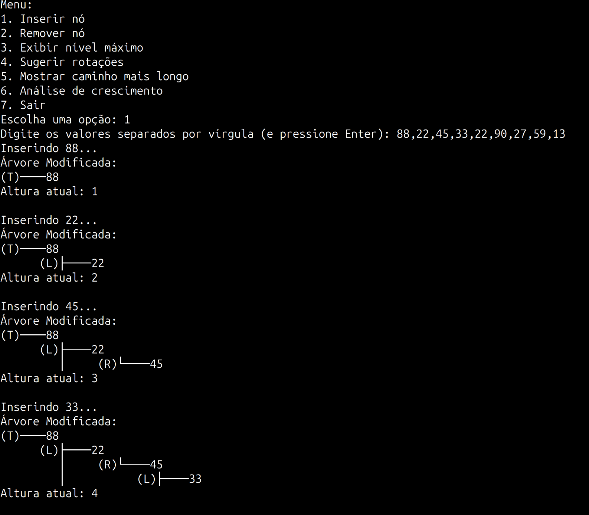
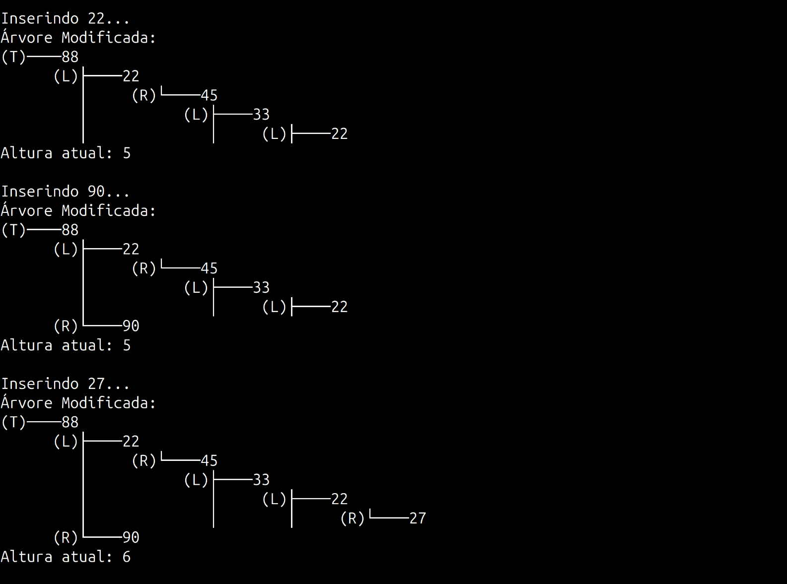
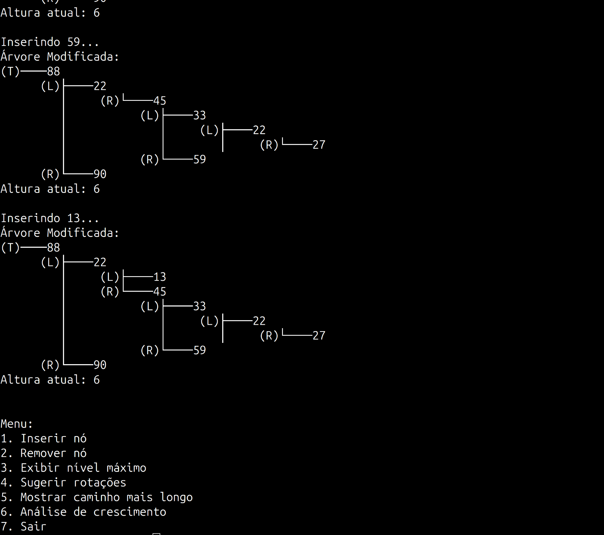

#### Remoção de Dados
A remoção de dados foi realizada para avaliar a eficiência do algoritmo na exclusão de valores da árvore. 
- Dados removidos: {`33, 90, 33, 45`}.

Durante o teste de remoção, os dados foram removidos da árvore, com a árvore sendo reequilibrada automaticamente após cada remoção.

As imagens a seguir mostram como a árvore se ajusta após cada remoção:
- **[`remocoes1.png`](images/remocoes1.png)**: A árvore após a remoção do primeiro conjunto de valores, ainda desbalanceada.
- **[`remocoes2.png`](images/remocoes2.png)**: A árvore após a remoção final, já com uma estrutura mais organizada.


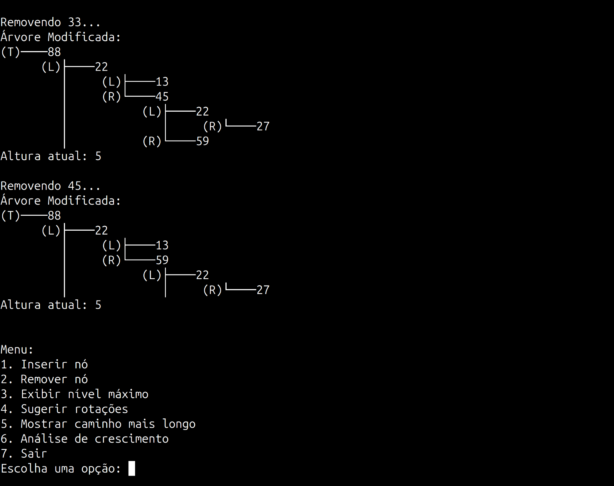

#### Exibição do Nível Máximo
A função de **nível máximo** foi executada, mostrando o nível máximo da árvore atual. O nível máximo é a maior distância entre a raiz e o nó mais distante.

A imagem a seguir ilustra o nível máximo da árvore:
- **[`nivelMaximo.png`](images/nivelMaximo.png)**: Exibe a árvore com o cálculo do nível máximo, que ajuda a avaliar o balanceamento da estrutura.

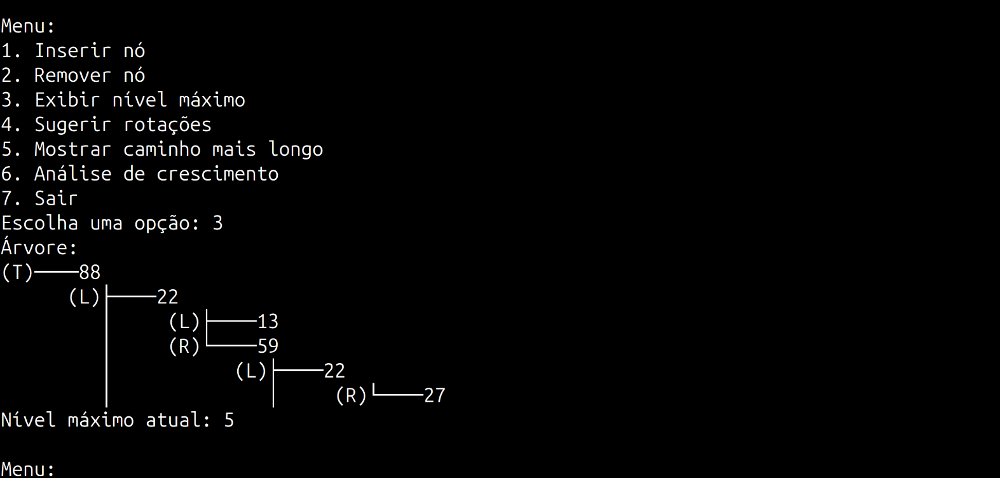

#### Sugestão de Rotações
Durante o teste, a opção de balanceamento foi ativada para sugerir e aplicar rotações conforme necessário. O balanceamento ocorre automaticamente quando a diferença entre as subárvores da árvore binária ultrapassa um limite.

As imagens a seguir mostram as sugestões de rotações e os ajustes realizados na árvore:
- **[`rotacoes1.png`](images/rotacoes1.png)**: Exibe a árvore antes das rotações, onde o desbalanceamento é evidente.
- **[`rotacoes2.png`](images/rotacoes2.png)**: Mostra a árvore após a aplicação das rotações, com a estrutura mais balanceada.

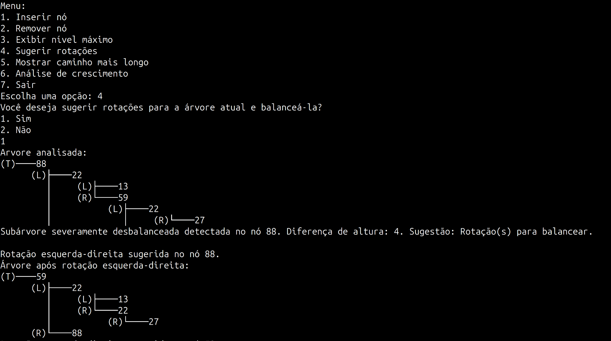
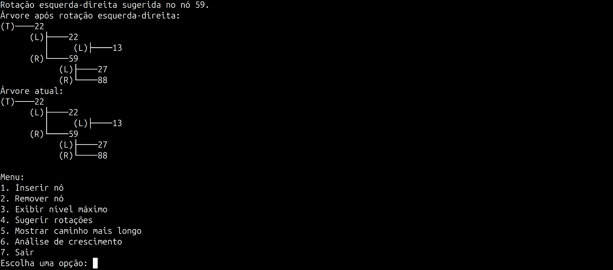

#### Exibição do Caminho Máximo
A função de **caminho máximo** foi executada, mostrando o maior caminho da árvore atual. O caminho máximo é a distância da raiz até o nó mais distante, refletindo a altura total da árvore.

A imagem a seguir ilustra o caminho mais longo da árvore:
- **[`maiorCaminho.png`](images/maiorCaminho.png)**: Exibe o maior caminho, que é útil para calcular a altura da árvore e entender o impacto do balanceamento nas operações de busca.

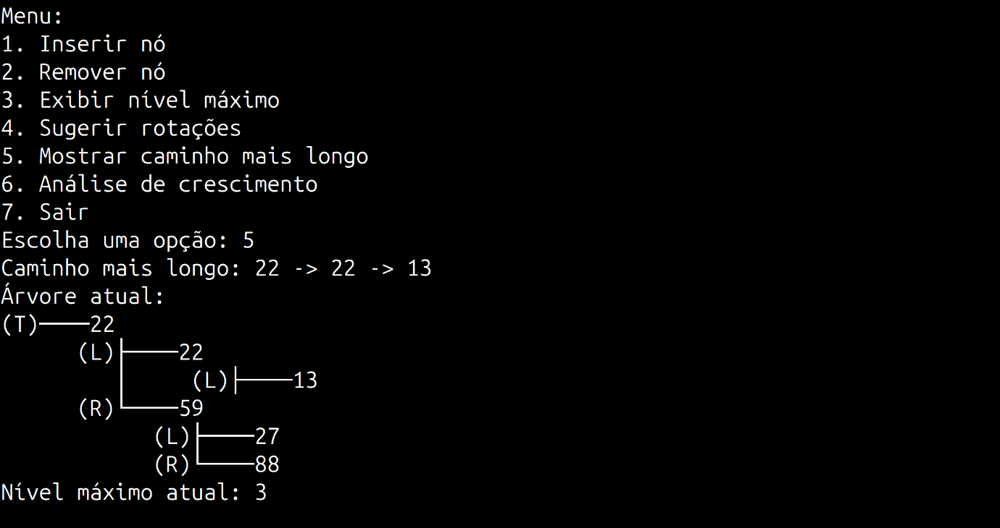

6. **Análise de Crescimento**:
    - O teste da **Análise de Crescimento** foi realizado para comparar o desempenho de árvores balanceadas e desbalanceadas. Durante a execução, a função avaliou como a altura das árvores cresceu à medida que a árvore se desbalanceava.
    - As imagens a seguir ilustram a evolução das árvores e o impacto do balanceamento:
    - **[`analiseDeCrescimento1.png`](images/analiseDeCrescimento1.png)**: Mostra a comparação da altura das árvores conforme o número de nós aumenta. As árvores mais desbalanceadas têm uma altura maior.
    - **[`analiseDeCrescimento2.png`](images/analiseDeCrescimento2.png)**: Exibe a primeira parte da análise com a árvore desbalanceada, mostrando o crescimento desproporcional da altura.
    - **[`analiseDeCrescimento3.png`](images/analiseDeCrescimento3.png)**: Exibe a árvore mais balanceada, com uma altura significativamente menor.
    - **[`analiseDeCrescimento4.png`](images/analiseDeCrescimento4.png)**: Mostra a diferença na altura entre a árvore desbalanceada e a quase equilibrada.
    - **[`analiseDeCrescimento5.png`](images/analiseDeCrescimento5.png)**: O gráfico final mostrando a depreciação da altura das árvores, com o impacto visual do balanceamento.
  
    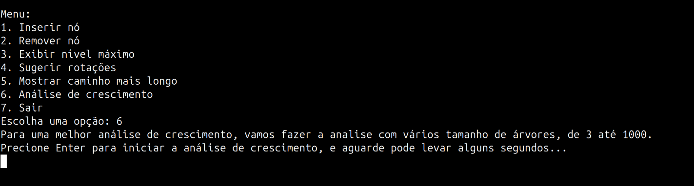
    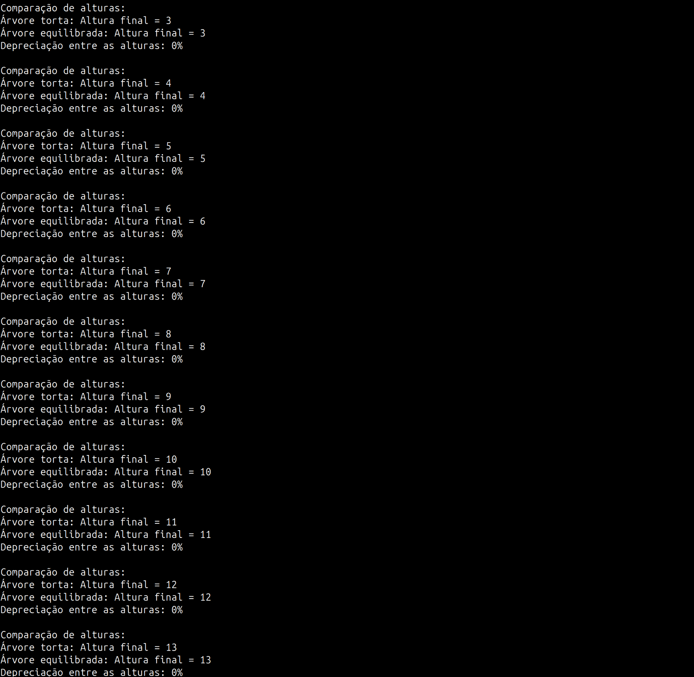
    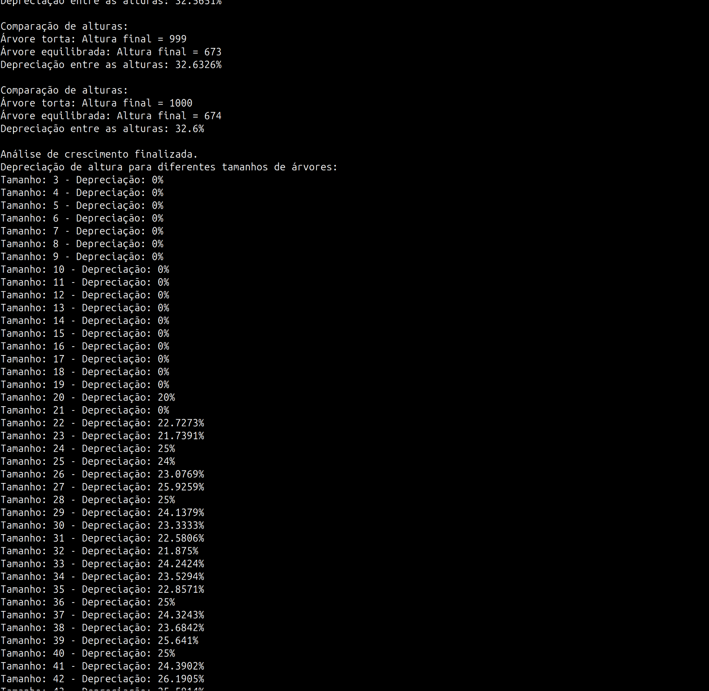
    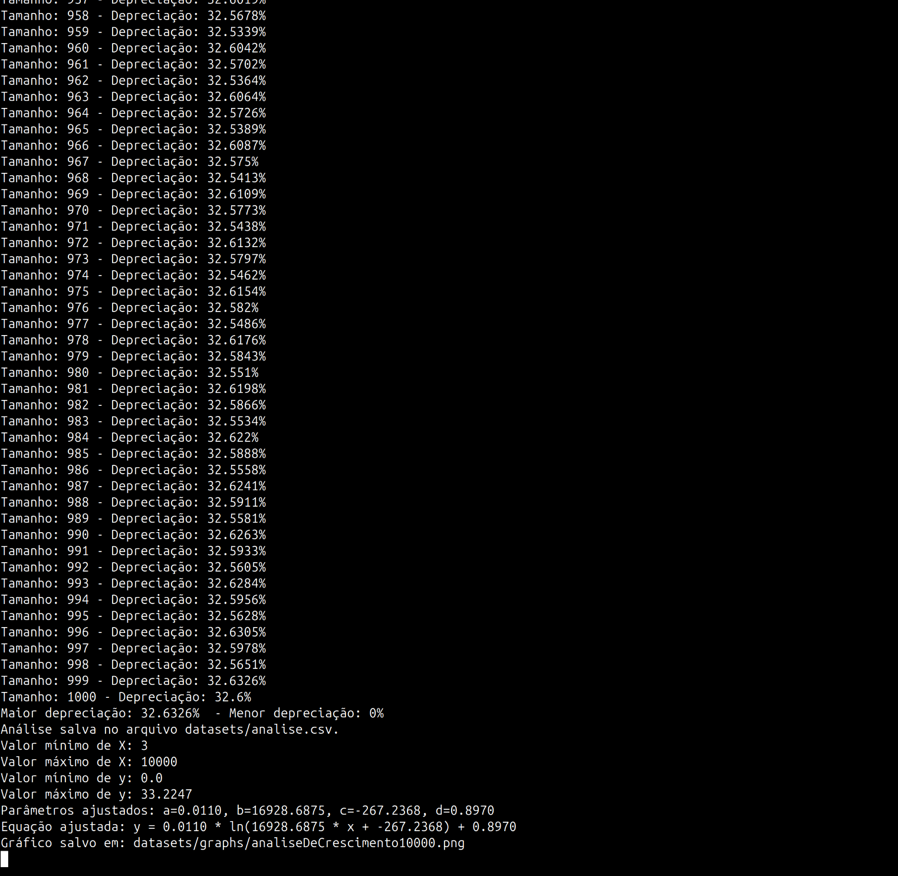
    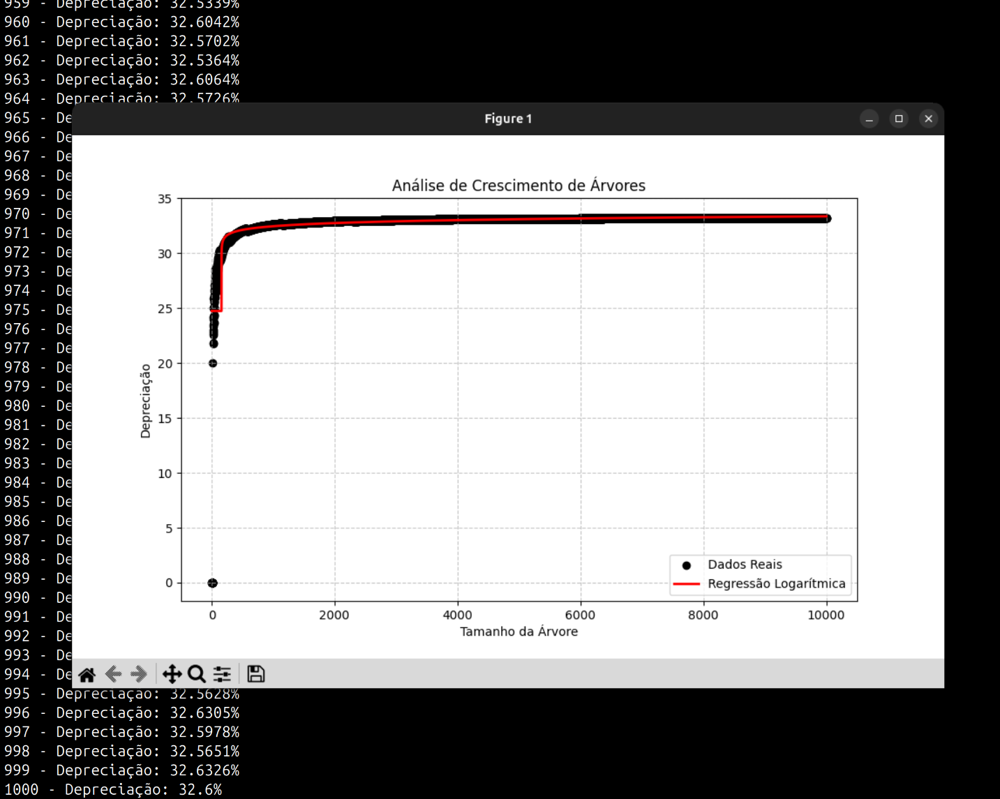

## 📊 Análise de Resultados

A análise dos resultados terá como foco a parte de **Análise de Crescimento**, que compara o desempenho de árvores desbalanceadas e quase equilibradas. A análise foi realizada para conjuntos de dados de tamanhos variados, permitindo avaliar o impacto do balanceamento na altura das árvores e, consequentemente, no desempenho das operações.

### Análise de Crescimento

A **Análise de Crescimento** foi realizada para comparar o desempenho de árvores desbalanceadas e quase equilibradas, com ênfase em como o balanceamento impacta na altura da árvore e, consequentemente, no desempenho das operações. A função de análise de crescimento foi executada em dois testes distintos, com os seguintes conjuntos de dados:

- **Teste 1**: Dados inseridos de `3` a `1000`.
- **Teste 2**: Dados inseridos de `3` a `10000`.

As imagens geradas durante esses testes mostram o comportamento do crescimento das árvores ao longo do processo de inserção e balanceamento.

#### Testes Realizados:

- **Teste 1 - Dados de 3 a 1000**:
  - No primeiro teste, foram inseridos dados variando de `3` a `1000`, e o gráfico gerado, chamado **[`analiseDeCrescimento1000.png`](images/analiseDeCrescimento1000.png)**, mostra como a altura da árvore aumentou conforme os dados foram sendo inseridos. Observamos um comportamento logarítmico, onde o crescimento da altura da árvore se estabiliza à medida que o número de nós cresce, o que indica que o balanceamento das árvores quase equilibradas ajudou a manter a altura sob controle. O gráfico mostra a diferença de altura entre a árvore desbalanceada (torta) e a quase equilibrada, onde a primeira apresenta um aumento exponencial da altura enquanto a segunda se mantém mais controlada.

  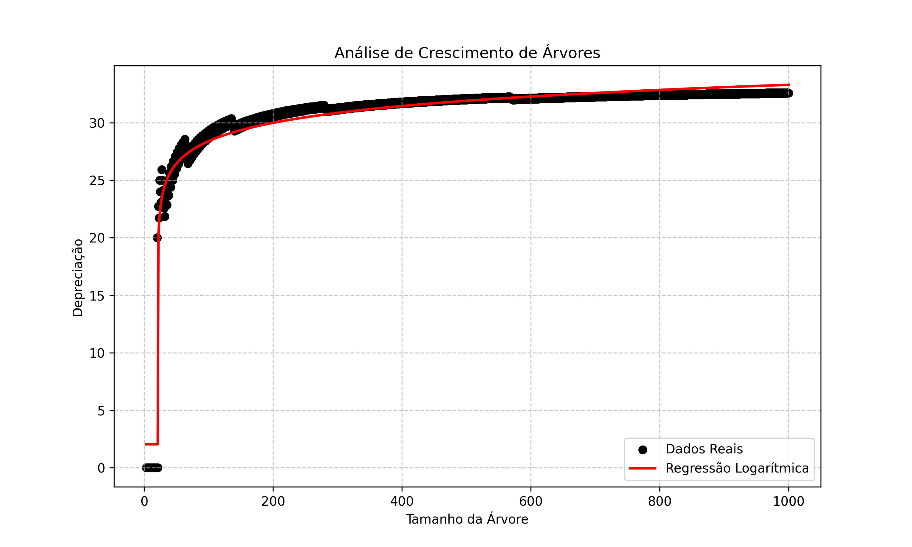

- **Teste 2 - Dados de 3 a 10000**:
  - No segundo teste, os dados variaram de `3` a `10000`. O gráfico **[`analiseDeCrescimento10000.png`](images/analiseDeCrescimento10000.png)** revela um comportamento semelhante, com a altura das árvores aumentando de forma controlada, mesmo para conjuntos de dados maiores. A medida que o número de nós cresce, a diferença de altura entre as árvores desbalanceadas e as quase equilibradas permanece significativa, embora os valores de depreciação não ultrapassem 34%, como observado em ambos os testes. Esse comportamento reforça a eficácia do balanceamento na manutenção de uma estrutura eficiente, mesmo em grandes volumes de dados.

  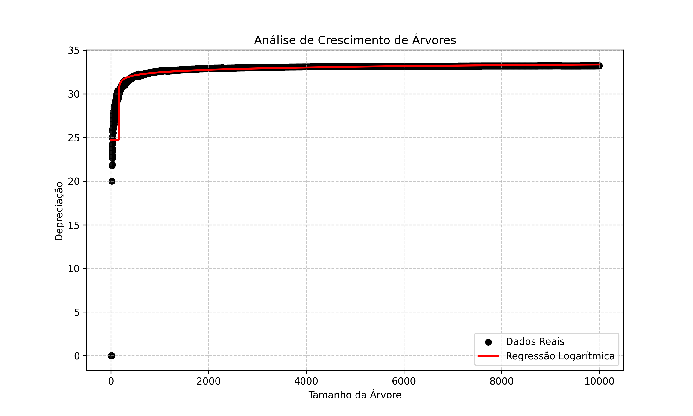

#### Comportamento Logarítmico

A análise dos gráficos mostra que, embora as árvores desbalanceadas cresçam em altura de forma exponencial, o comportamento das árvores **quase equilibradas** segue uma tendência logarítmica. Isso significa que, à medida que o número de nós aumenta, o impacto do balanceamento ainda é significativo, mas não tão forte quanto em árvores balanceadas automaticamente (como AVL). O comportamento logarítmico ocorre porque, mesmo sem balanceamento automático, a árvore mantém um nível de equilíbrio razoável durante a primeira metade das inserções.

O **comportamento logarítmico** reflete a eficácia do balanceamento parcial em manter a árvore eficiente, mesmo em entradas grandes, o que é uma das principais vantagens de se ter uma árvore "quase balanceada", mesmo sem usar um balanceamento automático completo.

O comportamento logarítmico é dado pelos seguintes fatores:

1. **Árvores Quase Equilibradas (Sem Balanceamento Automático)**:
   - A árvore não é balanceada automaticamente, mas **aplica rotações** durante a primeira metade das inserções (`m/2`). Isso faz com que ela não cresça de maneira descontrolada. A altura da árvore cresce de forma **mais controlada** em comparação com uma árvore desbalanceada, mas ainda não atinge a eficiência de uma árvore balanceada, como uma AVL.
   - O parâmetro `n = m/3` define a **tolerância ao desbalanceamento**. Quando a diferença entre a altura máxima e mínima da árvore excede esse valor, a árvore aplica rotações, tentando manter o balanceamento dentro de um nível razoável. Portanto, ao contrário de uma árvore completamente desbalanceada, a árvore **quase equilibrada** mantém uma altura mais controlada, mas não chega a ser logaritmica como uma árvore AVL.
   
2. **Comportamento em Árvore Torta (Desbalanceada)**:
   - Em uma **árvore torta**, onde as inserções ocorrem de forma ordenada (como uma lista), a árvore cresce **linearmente**. A cada inserção, o novo nó é adicionado como um filho do nó anterior, criando um caminho longo, como se fosse uma lista encadeada. Isso significa que a altura da árvore aumenta de forma **linear**, ou seja, a altura será igual ao número de nós `N` (ou seja, altura `N`).
   - Isso resulta em uma estrutura muito ineficiente para operações de busca, pois você precisa percorrer toda a altura da árvore para encontrar um nó, o que aumenta o custo de operações como busca e inserção para **O(N)**.

3. **Árvores Quase Equilibradas e Redução de Altura**:
   - Quando os dados são inseridos na árvore quase equilibrada, ela tenta manter o balanceamento de forma gradual. Ou seja, durante as primeiras inserções, ela faz ajustes para evitar desbalanceamento excessivo, mas após o meio das inserções, ela **não tenta mais balancear automaticamente**, permitindo que a árvore cresça de maneira mais flexível, mas ainda sim com uma altura menor do que a de uma árvore torta.
   - Mesmo que a árvore não seja completamente balanceada, o impacto das inserções controladas mantém a altura da árvore significativamente **menor** do que a de uma árvore desbalanceada.

4. **Por que o Crescimento é Logarítmico?**:
   - A chave para entender o comportamento logarítmico está no conceito de **divisão parcial** e **controle de balanceamento**. Durante a primeira metade das inserções, a árvore tenta balancear as subárvores, garantindo que a altura não aumente de forma tão rápida. 
   - O processo de inserção é controlado pela tolerância `n`, que impede que a árvore se desbalanceie excessivamente. Esse tipo de abordagem permite que a árvore cresça de maneira mais controlada e eficiente, sem o custo computacional de um balanceamento automático completo (como ocorre nas árvores AVL).
   
5. **Impacto do Comportamento Logarítmico**:
   - Esse comportamento tem um impacto direto na eficiência das operações. Como a altura da árvore é controlada durante as inserções, operações como **inserção**, **remoção** e **busca** em uma árvore quase equilibrada têm complexidade **O(log N)**, embora não tão eficiente quanto uma árvore AVL, ainda apresenta uma melhoria significativa em comparação com uma árvore desbalanceada.
   - Em contraste, operações em uma árvore desbalanceada, como uma árvore torta, têm complexidade **O(N)**, o que torna essas operações muito mais lentas à medida que o número de elementos aumenta.


#### Depreciação de Altura entre Árvores

A **depreciação de altura** entre uma árvore torta (desbalanceada) e uma árvore quase equilibrada foi analisada para avaliar o impacto do balanceamento nas operações de busca e inserção. A depreciação foi calculada como a diferença relativa entre as alturas das duas árvores, expressa como:

$$
\text{Depreciação} = \left( \frac{\text{Altura da Árvore Torta} - \text{Altura da Árvore Equilibrada}}{\text{Altura da Árvore Torta}} \right) \times 100
$$

##### Comportamento da Depreciação

A árvore torta, ao ser construída com dados em ordem crescente ou decrescente, resulta em um crescimento exponencial da altura. Em contraste, a árvore quase equilibrada, construída com inserções mais distribuídas e balanceamento parcial até a metade das inserções, mantém uma altura significativamente menor. No entanto, o valor da depreciação pode variar dependendo de como as árvores são geradas.

1. **Valores Típicos de Depreciação**:
   - Durante os testes realizados, tanto com o máximo de `1000` quanto com `10000` nós, a maioria dos valores de depreciação ficou entre **32% e 34%**. Isso ocorre porque, embora a árvore quase equilibrada não seja perfeitamente balanceada, ela ainda possui uma estrutura mais eficiente do que a árvore torta, que cresce descontroladamente. O balanceamento parcial permite que a árvore quase equilibrada mantenha sua altura razoavelmente baixa, resultando em uma depreciação moderada.

2. **Variação da Depreciação com a Configuração da Árvore**:
   - A depreciação observada pode variar bastante dependendo da distribuição dos dados e da estratégia de balanceamento aplicada:
     - Em alguns testes manuais, quando a árvore quase equilibrada ficou mais desbalanceada (por exemplo, com inserções sequenciais ou menos controladas), a depreciação chegou a **98%**, refletindo a altura excessiva da árvore torta em comparação com a quase equilibrada.
     - Em outros casos, quando a árvore quase equilibrada foi construída de forma mais próxima de um balanceamento ideal, a depreciação caiu para **13%**, mostrando o impacto de uma inserção bem distribuída e mais próxima de uma árvore balanceada.

3. **Influência do Balanceamento Parcial**:
   - A estratégia de balanceamento, que aplica rotação apenas até a metade das inserções (com uma tolerância ao desbalanceamento de `n = m/3`), tem um papel fundamental na depreciação observada. Quando a árvore está bem próxima de estar balanceada, o valor da depreciação tende a aumentar significativamente, pois a diferença de altura entre a árvore torta e a quase equilibrada torna-se mais evidente.
   - Essa abordagem permite que a árvore quase equilibrada simule o comportamento de uma árvore balanceada, mas ainda com a possibilidade de apresentar uma variação de altura conforme os dados são inseridos.

Os testes confirmaram que as árvores quase equilibradas têm um desempenho significativamente melhor do que as árvores tortas, com uma depreciação de altura variando entre 32% e 34% na maioria dos casos. Contudo, o valor de depreciação é altamente sensível à forma como os dados são inseridos na árvore. Quando a árvore quase equilibrada é mais próxima de um balanceamento ideal, a depreciação tende a ser menor, enquanto árvores mais desbalanceadas podem gerar depreciações muito altas. Essa análise destaca a importância de estratégias adequadas de inserção e balanceamento para otimizar o desempenho da árvore binária e reduzir os custos das operações.

</div>

<p align="right">(<a href="#readme-topo">voltar ao topo</a>)</p>


## 🏁 Conclusão

<div align="justify">

Este trabalho explorou a implementação e análise de algoritmos voltados para o cálculo do nível máximo em árvores binárias, destacando sua importância no entendimento da eficiência e do balanceamento dessas estruturas de dados. Ao longo do estudo, foram desenvolvidas funcionalidades para inserção, remoção, cálculo de altura, visualização do caminho mais longo e análise de crescimento de árvores desbalanceadas e quase equilibradas. Além disso, foram abordadas estratégias para sugerir rotações, proporcionando uma visão prática sobre o impacto do balanceamento nas operações.

Os resultados demonstraram que árvores quase equilibradas, mesmo sem um balanceamento automático completo, apresentam melhorias significativas na eficiência em relação a árvores tortas. O comportamento logarítmico observado nas árvores quase equilibradas reflete o sucesso da estratégia de balanceamento parcial, que conseguiu limitar o crescimento descontrolado da altura. Por outro lado, as árvores desbalanceadas, ao crescerem linearmente, evidenciaram o impacto negativo do desbalanceamento em operações básicas como busca e inserção.

A análise de crescimento destacou a eficácia do balanceamento parcial em reduzir a altura das árvores e melhorar o desempenho das operações, mesmo em cenários com grandes volumes de dados. O valor médio de depreciação de altura, em torno de 34%, ilustra a diferença significativa entre árvores desbalanceadas e quase equilibradas.

Por fim, este trabalho reforça a relevância do estudo de algoritmos de balanceamento em árvores binárias, tanto em contextos acadêmicos quanto práticos. A implementação modular e a visualização interativa desenvolvidas neste projeto proporcionam uma base sólida para a compreensão de conceitos fundamentais em estruturas de dados e para a aplicação em cenários reais que demandam eficiência e desempenho.

</div>

<p align="right">(<a href="#readme-topo">voltar ao topo</a>)</p>

## 🔨 Começando

<div align="justify">

  Nesta seção estão exemplificados os meios através dos quais se tornam possíveis a compilação e execução do programa apresentado.

</div>

### Pré-requisitos

<div align="justify">

  Inicialmente, algumas considerações importantes sobre como se deve preparar o ambiente para compilar e executar o programa:

</div>

> [!NOTE]
> Recomenda-se usar uma distribuição de sistema operacional Linux ou o Windows Subsystem for Linux (WSL), pois os comandos no [makefile][makefile] foram selecionados para funcionar em um ambiente [shell/bash][bash-url].

<div align="justify">

  Considerando um ambiente shell, garanta que os seguintes comandos já foram executados:
  - Atualize os pacotes antes da instalação dos compiladores:
  console
  sudo apt update
  
  - Instale a coleção de compiladores __GNU/g++_ e o _make__:
  console
  sudo apt install build-essential
  
  - Se necessário, instale o __make__ individualmente:
  console
  sudo apt install make
  
</div>

### Instalando

<div align="justify">
  Com o ambiente preparado, os seguintes passos são para a instalação, compilação e execução do programa localmente:

  1. Clone o repositório no diretório desejado:
  console
  git clone https://github.com/dudatsouza/pratica-arvores.git
  cd pratica-arvores

  2. Compile o programa com o __make__, o que gera a pasta build, que contém arquivos de objeto e um arquivo executável:
  console
  make
  
  3. Execute o programa da pasta build após a compilação:
  console
  make run
  

  4. Se necessário, apague a última compilação da pasta build:
  console
  make clean
  

  O programa estará pronto para ser testado. Veja a tabela abaixo com alguns comandos do makefile:

</div>

<div align="center">

  | Comando      | *Descrição*                           |
  |--------------|-----------------------------------------|
  | make       | Compila o programa.                     |
  | make run   | Executa o programa com o arquivo de entrada fornecido. |
  | make clean | Remove os arquivos compilados.          |

</div>

<p align="right">(<a href="#readme-topo">voltar ao topo</a>)</p>

## 🧪 Ambiente de Compilação e Execução

<div align="justify">

  O trabalho foi desenvolvido e testado em um ambiente específico, com as seguintes configurações:

</div>

<div align='center'>

![Ubuntu][ubuntu-badge]
![GCC][gcc-badge]
![Make][make-badge] 

| *Hardware* | *Especificações* |
|:------------:|:-------------------:|
| *Laptop*   | Dell Inspiron 13 5330 |
| *Processador* | Intel Core i7-1360P |
| *Memória RAM* | 16 GB DDR5 |
| *Sistema Operacional* | Windows 11 |
| *IDE* | Visual Studio Code |
| *Placa de Vídeo* | Intel Iris Xe Graphics |

</div>

> [!IMPORTANT] 
> Para que os testes tenham validade, considere as especificações
> do ambiente de compilação e execução do programa.

<p align="right">(<a href="#readme-topo">voltar ao topo</a>)</p>

## 📨 Contato

<div align="justify">

Para mais informações ou sugestões, sinta-se à vontade para entrar em contato:

- ✉️ **E-mail**: [](mailto:dudateixeirasouza@gmail.com)
- 💼 **LinkedIn**: [](https://www.linkedin.com/in/dudatsouza/)
- 📸 **Instagram**: [](https://www.instagram.com/dudat_18/) 
- 📱 **Telegram**: [](https://t.me/dudat_18)

Ficarei feliz em receber feedbacks, contribuições ou responder a quaisquer dúvidas que você possa ter sobre os trabalhos.

</div>

<p align="right">(<a href="#readme-topo">voltar ao topo</a>)</p>

## 🔖 Referências
1. CEFET-MG. **Aula 1 - Árvores Binárias**. Disponível em: [hhttps://ava.cefetmg.br/pluginfile.php/165783/mod_resource/content/8/Aula1.pdf](https://ava.cefetmg.br/pluginfile.php/165783/mod_resource/content/8/Aula1.pdf). Acesso em: 27 nov. 2024.

2. CEFET-MG. **Aula 2 - Árvores AVL**. Disponível em: [https://ava.cefetmg.br/pluginfile.php/261698/mod_resource/content/4/Aula2.pdf](https://ava.cefetmg.br/pluginfile.php/261698/mod_resource/content/4/Aula2.pdf). Acesso em: 27 nov. 2024.


[vscode-badge]: https://img.shields.io/badge/Visual%20Studio%20Code-0078d7.svg?style=for-the-badge&logo=visual-studio-code&logoColor=white
[vscode-url]: https://code.visualstudio.com/docs/?dv=linux64_deb
[make-badge]: https://img.shields.io/badge/_-MAKEFILE-427819.svg?style=for-the-badge
[make-url]: https://www.gnu.org/software/make/manual/make.html
[cpp-badge]: https://img.shields.io/badge/c++-%2300599C.svg?style=for-the-badge&logo=c%2B%2B&logoColor=white
[cpp-url]: https://en.cppreference.com/w/cpp
[trabalho-url]: https://drive.google.com/file/d/15-BlglLNcPNOn9RRa__aTMfwafC-X43_/view?usp=sharing
[github-prof]: https://github.com/mpiress
[main-ref]: src/main.cpp
[branchAMM-url]: https://github.com/alvarengazv/trabalhosAEDS1/tree/AlgoritmosMinMax
[makefile]: ./makefile
[bash-url]: https://www.hostgator.com.br/blog/o-que-e-bash/
[lenovo-badge]: https://img.shields.io/badge/lenovo%20laptop-E2231A?style=for-the-badge&logo=lenovo&logoColor=white
[ubuntu-badge]: https://img.shields.io/badge/Ubuntu-E95420?style=for-the-badge&logo=ubuntu&logoColor=white
[Ubuntu-url]: https://ubuntu.com/
[ryzen5500-badge]: https://img.shields.io/badge/AMD%20Ryzen_5_5500U-ED1C24?style=for-the-badge&logo=amd&logoColor=white
[ryzen3500-badge]: https://img.shields.io/badge/AMD%20Ryzen_5_3500X-ED1C24?style=for-the-badge&logo=amd&logoColor=white
[windows-badge]: https://img.shields.io/badge/Windows-0078D6?style=for-the-badge&logo=windows&logoColor=white
[gcc-badge]: https://img.shields.io/badge/GCC-5C6EB8?style=for-the-badge&logo=gnu&logoColor=white

[linkedin-badge]: https://img.shields.io/badge/-LinkedIn-0077B5?style=for-the-badge&logo=Linkedin&logoColor=white
[telegram-badge]: https://img.shields.io/badge/Telegram-2CA5E0?style=for-the-badge&logo=telegram&logoColor=white
[gmail-badge]: https://img.shields.io/badge/-Gmail-D14836?style=for-the-badge&logo=Gmail&logoColor=white
