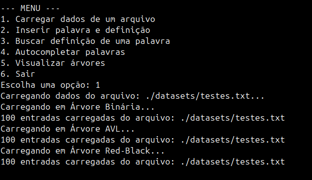
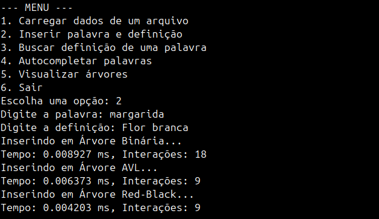
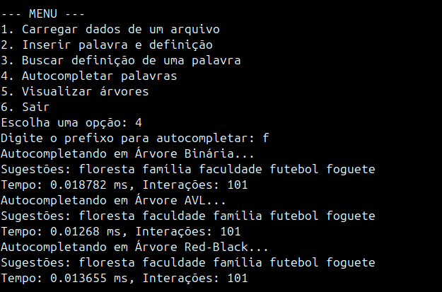
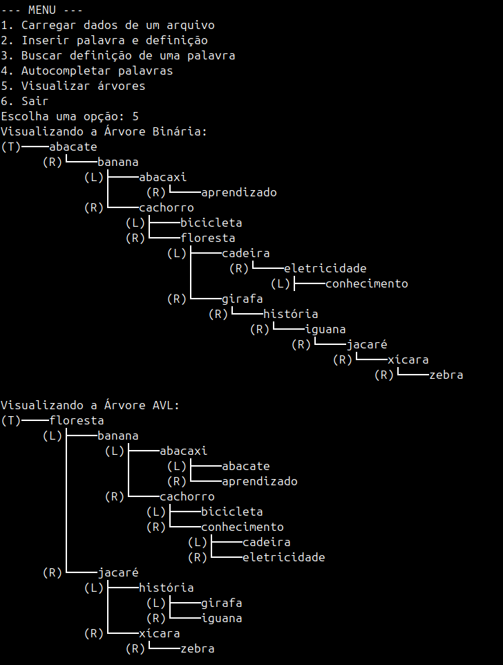
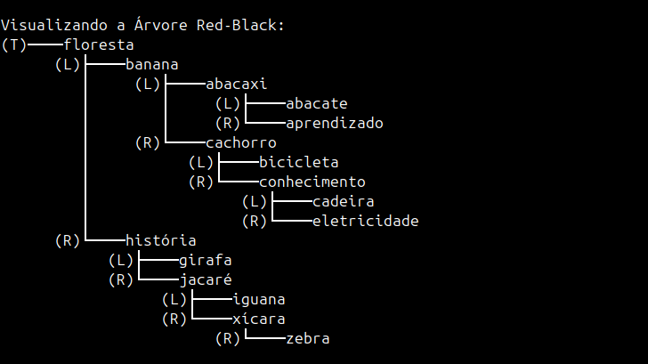

<a name="readme-topo"></a>

<h1 align='center'>
  📊 PROBLEMA 3 - Dicionário Eletrônico com Árvores Binárias
</h1>

<div align='center'>

[![SO][Ubuntu-badge]][Ubuntu-url]
[![IDE][vscode-badge]][vscode-url]
[![Make][make-badge]][make-url]
[![Linguagem][cpp-badge]][cpp-url]

Algoritmos e Estruturas de Dados II <br>
Engenharia de Computação <br>
Prof. Michel Pires da Silva <br>
CEFET-MG Campus V <br>
2024/2
</div>

<details>
  <summary>
    <b style='font-size: 15px'>
      📑 Sumário
    </b>
  </summary>
  <ol>
    <li><a href="#-introdução">🔍 Introdução</a></li>
    <li>
      <a href="#-objetivos">🎯 Objetivos</a>
      <ul>
        <li><a href="#objetivo-geral">Objetivo Geral</a></li>
        <li><a href="#objetivos-específicos">Objetivos Específicos</a></li>
      </ul>
    </li>
    <li>
      <a href="#-modelagem-de-aplicação">🔬 Modelagem de Aplicação</a>
      <ul>
        <li><a href="#menu-interativo">Menu Interativo</a></li>
        <li>
          <a href="#estruturas-de-dados">Estruturas de Dados</a>
          <ul>
            <li><a href="#árvore-binária-de-busca">Árvore Binária de Busca</a></li>
            <li><a href="#árvore-avl">Árvore AVL</a></li>
            <li><a href="#árvore-red-black">Árvore Red-Black</a></li>
          </ul>
        </li>
        <li>
          <a href="#funcionalidades-implementadas">Funcionalidades Implementadas</a>
          <ul>
            <li><a href="#inserção">Inserção</a></li>
            <li><a href="#busca">Busca</a></li>
            <li><a href="#autocompletar">Autocompletar</a></li>
            <li><a href="#visualização">Visualização</a></li>
          </ul>
        </li>
        <li>
          <a href="#decisões-de-implementação">Decisões de Implementação</a>
          <ul>
            <li><a href="#implementação-do-nodehpp">Implementação do `Node.hpp`</a></li>
            <li><a href="#implementação-de-uma-classe-para-cada-árvore">Implementação de uma Classe para Cada Árvore</a></li>
            <li><a href="#implementação-do-redblacknode">Implementação do `RedBlackNode`</a></li>
            <li><a href="#implementação-do-dictionary">Implementação do `Dictionary`</a></li>
            <li><a href="#implementação-de-result">Implementação de `Result`</a></li>
            <li><a href="#função-performtest">Função `performTest`</a></li>
            <li><a href="#necessidade-da-opção-de-printar-as-árvores-para-depuração">Necessidade da Opção de Printar as Árvores para Depuração</a></li>
          </ul>
        </li>
      </ul>
    </li>
    <li>
      <a href="#%EF%B8%8F-metodologia">🗳️ Metodologia</a>
      <ul>
        <li><a href="#-arquivos">Arquivos</a></li>
        <li><a href="#-estrutura-do-projeto">Estrutura do Projeto</a></li>
        <li><a href="#-bibliotecas">Bibliotecas</a></li>
        <li>
          <a href="#definições-e-estruturas-usadas">Definições e Estruturas Usadas</a>
          <ul>
            <li><a href="#arquivo-nodehpp">Arquivo `Node.hpp`</a></li>
            <li><a href="#arquivo-binarytreehpp">Arquivo `BinaryTree.hpp`</a></li>
            <li><a href="#arquivo-avltreehpp">Arquivo `AVLTree.hpp`</a></li>
            <li><a href="#arquivo-redblacktreehpp">Arquivo `RedBlackTree.hpp`</a></li>
            <li><a href="#arquivo-problema3hpp">Arquivo `problema3.hpp`</a></li>
          </ul>
        </li>
        <li>
          <a href="#-funções-implementadas">Funções Implementadas</a>
          <ul>
            <li><a href="#arquivo-maincpp">Arquivo main.cpp</a></li>
            <li><a href="#arquivo-binarytreecpp">Arquivo BinaryTree.cpp</a></li>
            <li><a href="#arquivo-avltreecpp">Arquivo AVLTree.cpp</a></li>
            <li><a href="#arquivo-redblacktreecpp">Arquivo RedBlackTree.cpp</a></li>
            <li><a href="#arquivo-problema3cpp">Arquivo problema3.cpp</a></li>
          </ul>
        </li>
      </ul>
    </li>
    <li>
      <a href="#-testes-e-resultados">📊 Testes e Resultados</a>
      <ul>
        <li>
          <a href="#estrutura-do-arquivo-de-entrada">Estrutura do Arquivo de Entrada</a>
          <ul>
            <li><a href="#exemplo-da-estrutura-do-arquivo">Exemplo da Estrutura do Arquivo</a></li>
          </ul>
        </li>
        <li>
          <a href="#testes-realizados">Testes Realizados</a>
          <ul>
            <li><a href="#1-carregamento-dos-dados">1. Carregamento de Dados</a></li>
            <li><a href="#2-inserção-de-novas-palavras-e-definições">2. Inserção de Novas Palavras e Definições</a></li>
            <li><a href="#3-busca-de-definições">3. Busca de Definições</a></li>
            <li><a href="#4-autocompletar-palavras">4. Autocompletar Palavras</a></li>
            <li><a href="#5-visualização-das-árvores">5. Visualização das Árvores</a></li>
          </ul>
        </li>
        <li>
          <a href="#-análise-de-desempenho">Análise de Desempenho</a>
          <ul>
            <li>
              <a href="#análise-de-desempenho-das-árvores">Análise de Desempenho das Árvores</a>
              <ul>
                <li><a href="#resultados-observados">Resultados Observados</a></li>
              </ul>
            </li>
          </ul>
        </li>
        <li><a href="#-comparação-de-complexidade-computacional">Comparação de Complexidade Computacional</a></li>
      </ul>
    </li> 
    <li><a href="#-conclusão">🏁 Conclusão</a></li>
    <li>
      <a href="#-começando">🔨 Começando</a>
      <ul>
        <li><a href="#pré-requisitos">Pré-requisitos</a></li>
        <li><a href="#instalando">Instalando</a></li>
      </ul>
    </li>
    <li><a href="#-ambiente-de-compilação-e-execução">🧪 Ambiente de Compilação e Execução</a></li>
    <li><a href="#-contato">📨 Contato</a></li>
    <li><a href="#-referências">📚 Referências</a></li>
  </ol>
</details>

<details> 
  <summary>
    <b style='font-size: 12px'> Abstract </b> 
  </summary>

  O problema abordado neste projeto consiste na implementação e análise de **Árvores Binárias de Busca, Árvores AVL e Árvores Red-Black**, com foco na execução de operações fundamentais, como inserção, busca e autocompletar. Além disso, o projeto propõe uma análise comparativa entre essas estruturas em termos de eficiência, destacando o impacto do balanceamento automático nas árvores AVL e Red-Black.

  A solução foi desenvolvida utilizando a linguagem C++, devido à sua eficiência em manipulação de memória e estruturas de dados complexas. O programa apresenta uma interface interativa que permite a exploração de operações em diferentes cenários, bem como a visualização hierárquica das árvores geradas.

  🔑 <b>Keywords:</b> Dicionário Eletrônico, Árvores Binárias, Árvores AVL, Árvores Red-Black, Autocompletar, Estruturas de Dados, Balanceamento de Árvores, Algoritmos, C++
<br>
</details>

## 🔍 Introdução

<div align='justify'>

Este [trabalho][trabalho-url] tem como base o **Problema 3** da lista de exercícios de **Árvores Binárias e AVL**, proposto na disciplina de **Algoritmos e Estruturas de Dados II**. O objetivo principal é implementar um **Dicionário Eletrônico** utilizando estruturas de dados como **Árvores Binárias de Busca**, **Árvores AVL** e **Árvores Red-Black**. O foco é permitir operações eficientes de inserção, busca e autocompletar, avaliando o impacto do balanceamento automático nas árvores.

O **Problema 3** introduz o desafio de explorar como essas estruturas se comportam em termos de desempenho e eficiência ao manipular grandes volumes de dados. Enquanto as árvores binárias oferecem uma solução inicial, árvores AVL e Red-Black são implementadas para garantir que o desempenho seja mantido mesmo em casos desbalanceados. Além disso, é incorporada a funcionalidade de autocompletar, que sugere palavras com base em um prefixo fornecido pelo usuário.

Por fim, este trabalho busca não apenas reforçar conceitos fundamentais de estruturas de dados, mas também apresentar uma análise comparativa entre essas árvores em termos de desempenho, memória e aplicabilidade. A solução inclui visualização interativa das árvores, permitindo que seu comportamento seja analisado de forma clara e dinâmica.

</div>

<p align="right">(<a href="#readme-topo">voltar ao topo</a>)</p>


## 🎯 Objetivos

<div align="justify">

### Objetivo Geral

O objetivo geral deste trabalho é desenvolver e analisar a implementação de um **Dicionário Eletrônico** utilizando estruturas de dados avançadas, como **Árvores Binárias de Busca**, **Árvores AVL** e **Árvores Red-Black**, com foco na eficiência em operações de busca, inserção e autocompletar, aplicando conceitos aprendidos na disciplina de **Algoritmos e Estruturas de Dados II**.

### Objetivos Específicos

- Implementar as estruturas de **Árvore Binária de Busca**, **AVL** e **Red-Black**, permitindo operações eficientes de inserção, busca e autocompletar.
- Avaliar o impacto do balanceamento automático nas árvores AVL e Red-Black, comparando com a performance de uma árvore binária não balanceada.
- Desenvolver uma funcionalidade de autocompletar que sugira palavras com base em prefixos fornecidos pelo usuário.
- Fornecer uma visualização interativa das árvores, permitindo que o usuário observe sua estrutura e o balanceamento após as operações.
- Realizar uma análise comparativa do desempenho das três árvores, considerando o tempo de execução e o número de interações em diferentes tamanhos de dados.
- Consolidar conceitos de eficiência, balanceamento e organização em estruturas de dados por meio de uma aplicação prática.

</div>

<p align="right">(<a href="#readme-topo">voltar ao topo</a>)</p>

## 🔬 Modelagem de Aplicação

<div align="justify">

A solução para o **Problema 3** foi desenvolvida de maneira modular, permitindo a interação do usuário com três estruturas distintas: **Árvore Binária de Busca**, **Árvore AVL** e **Árvore Red-Black**. Cada uma das estruturas foi implementada com foco em eficiência e funcionalidades específicas, como inserção, busca e autocompletar. O programa também inclui uma funcionalidade de visualização hierárquica das árvores, auxiliando na análise de suas estruturas.

### Menu Interativo
A interação com o programa é realizada por meio de um menu implementado no arquivo [`main.cpp`](src/main.cpp). As opções disponíveis são:
1. **Carregar Dados**: Permite carregar palavras e definições de um arquivo `.txt` para as três árvores.
2. **Inserir Palavra**: Insere manualmente uma palavra e sua definição em todas as árvores.
3. **Buscar Palavra**: Busca a definição de uma palavra específica.
4. **Autocompletar**: Sugere palavras com base em um prefixo.
5. **Visualizar Árvores**: Exibe a estrutura de cada uma das árvores de forma hierárquica.
6. **Sair**: Encerra o programa.

### Estruturas de Dados
#### Árvore Binária de Busca
- Implementada no arquivo [`BinaryTree.cpp`](src/BinaryTree.cpp)&#8203;:contentReference[oaicite:0]{index=0}.
- Permite inserções e buscas com complexidade \(O(\log n)\) em casos balanceados, mas pode degradar para \(O(n)\) em casos desbalanceados.
- Inclui a funcionalidade de autocompletar, que percorre a árvore coletando palavras com um prefixo específico.

#### Árvore AVL
- Implementada no arquivo [`AVLTree.cpp`](src/AVLTree.cpp)&#8203;:contentReference[oaicite:1]{index=1}.
- Mantém a altura balanceada automaticamente, garantindo eficiência mesmo com grandes conjuntos de dados.
- Inclui operações de rotação à esquerda e à direita para corrigir desequilíbrios após inserções.

#### Árvore Red-Black
- Implementada no arquivo [`RedBlackTree.cpp`](src/RedBlackTree.cpp)&#8203;:contentReference[oaicite:2]{index=2}.
- Utiliza regras de coloração para garantir um balanceamento aproximado com custo computacional reduzido.
- Suporta inserções rápidas e autocompletar por meio de percursos.

### Funcionalidades Implementadas
#### Inserção
- As funções `insert` foram implementadas para cada estrutura de árvore, registrando o número de interações e o tempo de execução.
- A Árvore AVL e a Red-Black realizam balanceamento automático após cada inserção.

#### Busca
- As funções `search` buscam a definição correspondente à palavra fornecida. Caso a palavra não seja encontrada, uma mensagem é exibida.
- O tempo de execução e o número de interações são registrados para análise comparativa.

#### Autocompletar
- As funções `autocomplete` percorrem a árvore em busca de palavras que começam com um prefixo fornecido.
- Palavras correspondentes são retornadas em tempo real, e o desempenho é avaliado.

#### Visualização
- A função `prettyPrintTree` foi implementada em [`problema3.cpp`](src/problema3.cpp) permitindo a visualização hierárquica das árvores.

### Decisões de Implementação
As decisões de implementação foram feitas para garantir modularidade, eficiência e facilidade de manutenção no código. Cada escolha foi guiada pelos requisitos do problema e pela necessidade de explorar e comparar o comportamento de diferentes estruturas de árvores. A seguir, discutimos os principais pontos:

#### Implementação do `Node.hpp`
A estrutura `Node` foi implementada como base para representar os nós das árvores binária de busca e AVL. Cada nó contém:
- Uma chave (`key`) e um valor (`definition`) para armazenar as palavras e suas definições.
- Ponteiros para os filhos esquerdo e direito, permitindo a construção da árvore.
- Essa abordagem modular facilita a reutilização da estrutura em diferentes tipos de árvores.

#### Implementação de uma Classe para Cada Árvore
Cada tipo de árvore foi implementado em sua própria classe (`BinaryTree`, `AVLTree` e `RedBlackTree`), permitindo modularidade e encapsulamento:
- **`BinaryTree`**: Serve como base para entender os princípios de árvores binárias de busca, mas sem garantias de balanceamento.
- **`AVLTree`**: Inclui funções adicionais para balanceamento automático, como rotações à esquerda e à direita.
- **`RedBlackTree`**: Utiliza a subclasse `RedBlackNode` para adicionar o atributo de cor, além de incluir regras específicas para manter o balanceamento.

Essa separação permite que cada classe seja testada e mantida independentemente, além de facilitar futuras expansões ou ajustes específicos em cada estrutura.

#### Implementação do `RedBlackNode`
A classe `RedBlackNode` expande a estrutura básica de `Node` para incluir o atributo `color` (vermelho ou preto), necessário para implementar a lógica de balanceamento da árvore Red-Black. Essa abordagem facilita a reutilização de código, já que o restante da lógica de árvores (como ponteiros para filhos) permanece consistente.

#### Implementação do `Dictionary`
A interface `Dictionary` foi projetada para fornecer um conjunto unificado de operações, como `insert`, `search` e `autocomplete`. Cada classe de árvore herda dessa interface, garantindo que as mesmas operações possam ser chamadas de forma uniforme. Isso permite que o programa seja facilmente expandido para suportar novos tipos de árvores no futuro.

#### Implementação de `Result`
A estrutura `Result` foi criada para armazenar métricas de desempenho de cada operação:
- **`timeMs`**: Registra o tempo de execução da operação, permitindo análise de eficiência.
- **`interactions`**: Conta o número de interações realizadas (comparações, rotações, etc.), útil para medir o custo computacional.
Essa estrutura é fundamental para comparar o desempenho entre as diferentes árvores, especialmente em grandes volumes de dados.

#### Função `performTest`
A função `performTest` centraliza a lógica de execução das operações no programa, permitindo que as árvores sejam testadas uniformemente. Ela encapsula a lógica de inserção, busca e autocompletar, registrando os resultados e exibindo as métricas. Isso simplifica a execução de testes e garante que todas as árvores sejam avaliadas sob as mesmas condições.

#### Necessidade da Opção de Printar as Árvores para Depuração
A funcionalidade de visualizar as árvores (`prettyPrintTree`) foi implementada para auxiliar na depuração e análise estrutural:
- **Identificação de Desbalanceamentos**: Permite ao usuário observar diretamente a estrutura das árvores e identificar desbalanceamentos.
- **Validação de Operações**: Após inserções, buscas ou autocompletar, é possível verificar se as alterações foram realizadas corretamente.
- **Educação e Compreensão**: Ajuda a entender como as árvores binária, AVL e Red-Black se comportam e diferem em termos de estrutura.

A função imprime as árvores de forma hierárquica, indicando claramente os filhos esquerdo e direito, bem como o balanceamento interno.

</div>

<p align="right">(<a href="#readme-topo">voltar ao topo</a>)</p>


## 🗳️ Metodologia

<div align="justify">

O projeto foi desenvolvido em **C++**, utilizando a IDE **Visual Studio Code** para a escrita do código e organização modular dos arquivos. A solução inclui um menu interativo que permite ao usuário explorar e testar as funcionalidades de inserção, busca, autocompletar e visualização de estruturas de árvores. Além disso, foram criadas métricas para avaliar o desempenho das diferentes implementações de árvores.

### 📁 Arquivos

O projeto está estruturado em subdiretórios organizados por funcionalidades, com cada arquivo desempenhando um papel específico. A seguir estão descritos os principais arquivos:

- **[main.cpp](src/main.cpp)**: Implementa o menu interativo e controla a lógica principal do programa.
- **[problema3.hpp](src/problema3.hpp)** e **[problema3.cpp](src/problema3.cpp)**: Contêm funções auxiliares para gerenciar operações em árvores, incluindo carregamento de dados, autocompletar e visualização hierárquica das estruturas.
- **[BinaryTree.hpp](src/BinaryTree.hpp)** e **[BinaryTree.cpp](src/BinaryTree.cpp)**: Implementam a lógica da Árvore Binária de Busca.
- **[AVLTree.hpp](src/AVLTree.hpp)** e **[AVLTree.cpp](src/AVLTree.cpp)**: Implementam a Árvore AVL, incluindo operações de rotação e balanceamento automático.
- **[RedBlackTree.hpp](src/RedBlackTree.hpp)** e **[RedBlackTree.cpp](src/RedBlackTree.cpp)**: Implementam a Árvore Red-Black, utilizando regras de coloração para manter o balanceamento.
- **[Node.hpp](src/Node.hpp)**: Define a estrutura de um nó genérico para árvores binárias.
- **[makefile](makefile)**: Arquivo de automação que define as regras para compilar o projeto.
- **[datasets/testes.txt](datasets/testes.txt)**: Conjunto de dados de teste utilizado para inserir e buscar palavras no dicionário.
- **[make.sh](make.sh)**: Script de compilação que executa o `makefile` e gera o executável `app`.

### 📂 Estrutura do Projeto

A organização dos arquivos visa separar as funcionalidades em módulos, garantindo clareza e facilidade de manutenção. A seguir está a estrutura do projeto:

  ```.
  .
  ├── datasets
  │   └── testes.txt
  ├── src
  │   ├── main.cpp
  │   ├── problema3.cpp
  │   ├── problema3.hpp
  │   ├── BinaryTree.cpp
  │   ├── BinaryTree.hpp
  │   ├── AVLTree.cpp
  │   ├── AVLTree.hpp
  │   ├── RedBlackTree.cpp
  │   ├── RedBlackTree.hpp
  │   └── Node.hpp    
  ├── make.sh        
  ├── makefile                 
  └── README.md                 
  ```
### 📚 Bibliotecas

O projeto faz uso de bibliotecas da **STL (Standard Template Library)** do C++, que fornecem suporte a vetores, strings e algoritmos de manipulação de dados, além de bibliotecas padrão para entrada, saída e cálculos matemáticos.

#### Bibliotecas em C++

- **[iostream](https://cplusplus.com/reference/iostream/)**: Para operações de entrada e saída de dados.
- **[vector](https://cplusplus.com/reference/vector/)**: Para manipulação de vetores dinâmicos.
- **[string](https://cplusplus.com/reference/string/)**: Para manipulação de strings.
- **[fstream](https://cplusplus.com/reference/fstream/)**: Para leitura e escrita de arquivos.
- **[algorithm](https://cplusplus.com/reference/algorithm/)**: Para operações de ordenação e busca.
- **[chrono](https://cplusplus.com/reference/chrono/)**: Para medição de tempo de execução.

Essa divisão clara de arquivos, estrutura modular e uso eficiente de bibliotecas otimizam o desenvolvimento do projeto e facilitam futuras expansões.

</div>

<p align="right">(<a href="#readme-topo">voltar ao topo</a>)</p>

### Definições e Estruturas Usadas

<div align="justify">

#### Arquivo [`Node.hpp`](src/Node.hpp)
- **[`struct Node`](src/Node.hpp)**: 
  - Define a estrutura básica de um nó utilizado em todas as árvores implementadas.
    - **`std::string key`**: Armazena a chave do nó.
    - **`std::string definition`**: Armazena a definição associada à chave.
    - **`Node* left`**: Ponteiro para o filho esquerdo.
    - **`Node* right`**: Ponteiro para o filho direito.
    - **`Node* parent`**: Ponteiro para o nó pai (somente em algumas árvores).
    - **`int height`**: Altura do nó na árvore.
- **[`Node(const std::string& k, const std::string& d)`](src/Node.hpp)**: 
  - Construtor que inicializa um nó com chave e definição.

#### Arquivo [`BinaryTree.hpp`](src/BinaryTree.hpp)
- Declara a classe `BinaryTree`:
  - **Atributos:**
    - **[`Node* root`](src/BinaryTree.hpp)**: 
      - Raiz da árvore binária.
  - **Métodos Privados:**
    - **[`Result insert(Node*& node, const std::string& key, const std::string& definition, int& interactions)`](src/BinaryTree.hpp)**: 
      - Insere um nó na árvore.
      - Retorna um objeto `Result` com informações sobre a operação.
    - **[`Result search(Node* node, const std::string& key, std::string& definition, int& interactions)`](src/BinaryTree.hpp)**: 
      - Realiza busca de um nó baseado na chave.
      - Retorna um objeto `Result` com informações sobre a operação.
    - **[`void collectSuggestions(Node* node, const std::string& prefix, std::vector<std::string>& suggestions, int& interactions)`](src/BinaryTree.hpp)**: 
      - Coleta sugestões de palavras baseadas em prefixos.
      - Armazena as sugestões em um vetor de strings.
  - **Métodos Públicos:**
    - **[`BinaryTree()`](src/BinaryTree.hpp)**: 
      - Construtor da árvore binária.
    - **[`~BinaryTree()`](src/BinaryTree.hpp)**: 
      - Destrutor da árvore binária.
    - **[`Result insert(const std::string& key, const std::string& definition)`](src/BinaryTree.hpp)**: 
      - Insere um nó na árvore.
      - Faz chamada para o método privado `insert`.
    - **[`Result search(const std::string& key, std::string& definition)`](src/BinaryTree.hpp)**: 
      - Busca um nó na árvore.
      - Faz chamada para o método privado `search`.
    - **[`Result autocomplete(const std::string& prefix, std::vector<std::string>& suggestions)`](src/BinaryTree.hpp)**: 
      - Coleta sugestões de palavras baseadas em prefixos.
    - **[`Node* getRoot()`](src/BinaryTree.hpp)**: 
      - Retorna a raiz da árvore.
    
#### Arquivo [`AVLTree.hpp`](src/AVLTree.hpp)
- Deriva de `Dicionary` e adiciona funcionalidades específicas:
  - **Atributos:**
    - **[`Node* root`](src/AVLTree.hpp)**: 
      - Raiz da árvore AVL.
  - **Métodos Privados:**
    - **[`int height(Node* node)`](src/AVLTree.hpp)**: 
      - Calcula a altura de um nó.
    - **[`int balanceFactor(Node* node)`](src/AVLTree.hpp)**:
      - Calcula o fator de balanceamento de um nó.
    - **[`Node* rotateLeft(Node* node)`](src/AVLTree.hpp)**:
      - Realiza rotação à esquerda em um nó.
    - **[`Node* rotateRight(Node* node)`](src/AVLTree.hpp)**:
      - Realiza rotação à direita em um nó.
    - **[`Result insert(Node*& node, const std::string& key, const std::string& definition, int& interactions)`](src/AVLTree.hpp)**:
      - Insere um nó na árvore AVL.
      - Retorna um objeto `Result` com informações sobre a operação.
    - **[`Result search(Node* node, const std::string& key, std::string& definition, int& interactions)`](src/AVLTree.hpp)**:
      - Realiza busca de um nó baseado na chave.
      - Retorna um objeto `Result` com informações sobre a operação.
    - **[`void collectSuggestions(Node* node, const std::string& prefix, std::vector<std::string>& suggestions, int& interactions)`](src/AVLTree.hpp)**:
      - Coleta sugestões de palavras baseadas em prefixos.
      - Armazena as sugestões em um vetor de strings.
  - **Métodos Públicos:**
    - **[`AVLTree()`](src/AVLTree.hpp)**: 
      - Construtor da árvore AVL.
    - **[`~AVLTree()`](src/AVLTree.hpp)**:
      - Destrutor da árvore AVL.
    - **[`Result insert(const std::string& key, const std::string& definition)`](src/AVLTree.hpp)**:
      - Insere um nó na árvore AVL.
      - Faz chamada para o método privado `insert`.
    - **[`Result search(const std::string& key, std::string& definition)`](src/AVLTree.hpp)**:
      - Busca um nó na árvore AVL.
      - Faz chamada para o método privado `search`.
    - **[`Result autocomplete(const std::string& prefix, std::vector<std::string>& suggestions)`](src/AVLTree.hpp)**:
      - Coleta sugestões de palavras baseadas em prefixos.
    - **[`Node* getRoot()`](src/AVLTree.hpp)**:
      - Retorna a raiz da árvore AVL.

#### Arquivo [`RedBlackTree.hpp`](src/RedBlackTree.hpp)
- Estende `Node` e `Dicionary` e implementa propriedades específicas de uma Red-Black Tree:
  - **[`enum Color`](src/RedBlackTree.hpp)**: 
    - Define as cores dos nós (vermelho ou preto).
  - **[`struct RedBlackNode`](src/RedBlackTree.hpp)**:
    - Define a estrutura de um nó de uma árvore Red-Black.
      - **`Color color`**: Cor do nó (vermelho ou preto).
      - **`RedBlackNode(const std::string& k, const std::string& d, Color c = RED)`**: Construtor do nó.
  - **Atributos:**
    - **[`RedBlackNode* root`](src/RedBlackTree.hpp)**: 
      - Raiz da árvore Red-Black.
  - **Métodos Privados:**
    - **[`void rotateLeft(RedBlackNode*& node)`](src/RedBlackTree.hpp)**: 
      - Realiza rotação à esquerda em um nó.
    - **[`void rotateRight(RedBlackNode*& node)`](src/RedBlackTree.hpp)**: 
      - Realiza rotação à direita em um nó.
    - **[`void fixInsert(RedBlackNode*& node)`](src/RedBlackTree.hpp)**: 
      - Corrige desbalanceamentos após inserção.
    - **[`Result insert(RedBlackNode*& root, RedBlackNode*& node, int& interactions)`](src/RedBlackTree.hpp)**: 
      - Insere um nó na árvore Red-Black.
      - Retorna um objeto `Result` com informações sobre a operação.
    - **[`Result search(RedBlackNode* node, const std::string& key, std::string& definition, int& interactions)`](src/RedBlackTree.hpp)**:
      - Realiza busca de um nó baseado na chave.
      - Retorna um objeto `Result` com informações sobre a operação.
    - **[`void collectSuggestions(RedBlackNode* node, const std::string& prefix, std::vector<std::string>& suggestions, int& interactions)`](src/RedBlackTree.hpp)**:
      - Coleta sugestões de palavras baseadas em prefixos.
      - Armazena as sugestões em um vetor de strings.
  - **Métodos Públicos:**
    - **[`RedBlackTree()`](src/RedBlackTree.hpp)**: 
      - Construtor da árvore Red-Black. 
    - **[`~RedBlackTree()`](src/RedBlackTree.hpp)**:
      - Destrutor da árvore Red-Black.
    - **[`Result insert(const std::string& key, const std::string& definition)`](src/RedBlackTree.hpp)**:
      - Insere um nó na árvore Red-Black.
      - Faz chamada para o método privado `insert`.
    - **[`Result search(const std::string& key, std::string& definition)`](src/RedBlackTree.hpp)**:
      - Busca um nó na árvore Red-Black.
      - Faz chamada para o método privado `search`.
    - **[`Result autocomplete(const std::string& prefix, std::vector<std::string>& suggestions)`](src/RedBlackTree.hpp)**:
      - Coleta sugestões de palavras baseadas em prefixos.
    - **[`Node* getRoot()`](src/RedBlackTree.hpp)**:
      - Retorna a raiz da árvore Red-Black.


#### Arquivo [`problema3.hpp`](src/problema3.hpp)
- Declara funções auxiliares para testes e visualização de árvores:
  - **[`struct Result`](src/problema3.hpp)**: 
    - Estrutura para armazenar o tempo de execução e o número de interações.
      - **`double timeMs`**: Tempo em milissegundos.
      - **`int interactions`**: Número de interações realizadas.
  - **[`class Dictionary`](src/problema3.hpp)**:
    - Classe abstrata para dicionário.
      - **[`virtual ~Dictionary() = default`](src/problema3.hpp)**: Destrutor virtual.
      - **[`virtual Result insert(const std::string& key, const std::string& definition) = 0`](src/problema3.hpp)**: Insere uma palavra e sua definição.
      - **[`virtual Result search(const std::string& key, std::string& definition) = 0`](src/problema3.hpp)**: Busca a definição de uma palavra.
      - **[`virtual Result autocomplete(const std::string& prefix, std::vector<std::string>& suggestions) = 0`](src/problema3.hpp)**: Sugerir palavras com base em um prefixo.
  - **[`void performTest(Dictionary* tree, const std::string& operation, const std::string& key, const std::string& definition = "")`](src/problema3.hpp)**: 
    - Realiza testes em diferentes árvores.
  - **[`void loadDataset(Dictionary* tree, const std::string& filename)`](src/problema3.hpp)**: 
    - Carrega um conjunto de dados de um arquivo para as árvores.
  - **[`void prettyPrintTree(Node* root)`](src/problema3.hpp)**: 
    - Imprime a árvore de forma hierárquica.
  - **[`void printTreeHelper(Node* node, const std::string& prefix, bool isLeft)`](src/problema3.hpp)**: 
    - Auxilia na impressão hierárquica da árvore.

</div>

<p align="right">(<a href="#readme-topo">voltar ao topo</a>)</p>

### 📝 Funções Implementadas

<div align="justify">

As funções implementadas no projeto são responsáveis por realizar a manipulação das árvores binárias, AVL e Red-Black. A seguir, são apresentadas as funções implementadas no projeto, organizadas por arquivo fonte.

</div>


#### Arquivo [main.cpp](src/main.cpp)

O arquivo principal `main.cpp` é responsável por inicializar o programa e gerenciar o fluxo de execução por meio de um menu interativo. Ele utiliza as funções implementadas no arquivo `problema3.hpp` para realizar operações nas árvores.

- **Método [`void displayMenu()`](src/main.cpp)**:
  - Exibe o menu interativo para o usuário.

- **Método [`main()`](src/main.cpp)**:
  1. Exibe um menu para o usuário com opções relacionadas às operações nas árvores.
  2. Permite ao usuário carregar dados de um arquivo, inserir palavras, buscar definições, realizar autocompletar e visualizar as árvores.
  3. Chama as funções de suporte para execução das operações nas árvores binária de busca, AVL e Red-Black.
  4. Finaliza o programa quando o usuário opta por sair.

#### Arquivo [BinaryTree.cpp](src/BinaryTree.cpp)

O arquivo `BinaryTree.cpp` contém as implementações das funções específicas para a Árvore Binária de Busca (BST).

- **Constructor [`BinaryTree::BinaryTree()`](src/BinaryTree.cpp)**:
  - Inicializa a raiz da árvore como nula.

- **Destructor [`BinaryTree::~BinaryTree()`](src/BinaryTree.cpp)**:
  - Libera a memória alocada para a árvore.

- **Método [`BinaryTree::insert(Node*& node, const std::string& key, const std::string& definition, int& interactions)`](src/BinaryTree.cpp)**:
  - Insere uma palavra e definição na árvore binária de busca.
  - Retorna o número de interações realizadas.

- **Método [`BinaryTree::insert(const std::string& key, const std::string& definition)`](src/BinaryTree.cpp)**:
  - Insere uma palavra e definição na árvore binária de busca.
  - Retorna um objeto `Result` com informações sobre a operação.

- **Método [`BinaryTree::search(Node* node, const std::string& key, std::string& definition, int& interactions)`](src/BinaryTree.cpp)**:
  - Realiza a busca de uma palavra na árvore binária de busca.
  - Retorna o número de interações realizadas.

- **Método [`BinaryTree::search(const std::string& key, std::string& definition)`](src/BinaryTree.cpp)**:
  - Realiza a busca de uma palavra na árvore binária de busca.
  - Retorna um objeto `Result` com informações sobre a operação.

- **Método [`BinaryTree::collectSuggestions(Node* node, const std::string& prefix, std::vector<std::string>& suggestions, int& interactions)`](src/BinaryTree.cpp)**:
  - Coleta sugestões de palavras baseadas em um prefixo.
  - Armazena as sugestões em um vetor de strings.

- **Método [`BinaryTree::autocomplete(const std::string& prefix, std::vector<std::string>& suggestions)`](src/BinaryTree.cpp)**:
  - Coleta sugestões de palavras baseadas em um prefixo.
  - Retorna um objeto `Result` com informações sobre a operação.
  
#### Arquivo [AVLTree.cpp](src/AVLTree.cpp)

O arquivo `AVLTree.cpp` implementa as funções específicas de uma Árvore AVL.

- **Constructor [`AVLTree::AVLTree()`](src/AVLTree.cpp)**:
  - Inicializa a raiz da árvore AVL como nula.

- **Destructor [`AVLTree::~AVLTree()`](src/AVLTree.cpp)**:
  - Libera a memória alocada para a árvore AVL.

- **Método [`AVLTree::height(Node* node)`](src/AVLTree.cpp)**:
  - Calcula a altura de um nó na árvore.

- **Método [`AVLTree::balanceFactor(Node* node)`](src/AVLTree.cpp)**:
  - Calcula o fator de balanceamento de um nó.

- **Método [`AVLTree::rotateLeft(Node* node)`](src/AVLTree.cpp)**:
  - Realiza uma rotação simples à esquerda para corrigir desbalanceamentos.

- **Método [`AVLTree::rotateRight(Node* node)`](src/AVLTree.cpp)**:
  - Realiza uma rotação simples à direita para corrigir desbalanceamentos.

- **Método [`AVLTree::insert(Node*& node, const std::string& key, const std::string& definition, int& interactions)`](src/AVLTree.cpp)**:
  - Insere uma palavra e definição na árvore AVL, ajustando a estrutura para manter as propriedades de coloração e balanceamento.
  
- **Método [`AVLTree::insert(const std::string& key, const std::string& definition)`](src/AVLTree.cpp)**:
  - Insere uma palavra e definição na árvore AVL.
  - Retorna um objeto `Result` com informações sobre a operação.

- **Método [`AVLTree::search(Node* node, const std::string& key, std::string& definition, int& interactions)`](src/AVLTree.cpp)**:
  - Realiza a busca de uma palavra na árvore AVL.
  - Retorna o número de interações realizadas.

- **Método [`AVLTree::search(const std::string& key, std::string& definition)`](src/AVLTree.cpp)**:
  - Realiza a busca de uma palavra na árvore AVL.
  - Retorna um objeto `Result` com informações sobre a operação.
  
- **Método [`AVLTree::collectSuggestions(Node* node, const std::string& prefix, std::vector<std::string>& suggestions, int& interactions)`](src/AVLTree.cpp)**:
  - Coleta sugestões de palavras baseadas em um prefixo.
  - Armazena as sugestões em um vetor de strings.

- **Método [`AVLTree::autocomplete(const std::string& prefix, std::vector<std::string>& suggestions)`](src/AVLTree.cpp)**:
  - Coleta sugestões de palavras baseadas em um prefixo.
  - Retorna um objeto `Result` com informações sobre a operação.
  

#### Arquivo [RedBlackTree.cpp](src/RedBlackTree.cpp)

O arquivo `RedBlackTree.cpp` implementa as funções específicas de uma Árvore Red-Black.

- **Constructor [`RedBlackTree::RedBlackTree()`](src/RedBlackTree.cpp)**:
  - Inicializa a raiz da árvore Red-Black como nula.

- **Destructor [`RedBlackTree::~RedBlackTree()`](src/RedBlackTree.cpp)**:
  - Libera a memória alocada para a árvore Red-Black.

- **Método [`RedBlackTree::rotateLeft(RedBlackNode*& node)`](src/RedBlackTree.cpp)**:
  - Realiza uma rotação à esquerda em um nó.

- **Método [`RedBlackTree::rotateRight(RedBlackNode*& node)`](src/RedBlackTree.cpp)**:
  - Realiza uma rotação à direita em um nó.

- **Método [`RedBlackTree::fixInsert(RedBlackNode*& node)`](src/RedBlackTree.cpp)**:
  - Corrige desbalanceamentos após a inserção de um nó.

- **Método [`RedBlackTree::insert(RedBlackNode*& root, RedBlackNode*& node, int& interactions)`](src/RedBlackTree.cpp)**:
  - Insere uma palavra e definição na árvore Red-Black, ajustando a estrutura para manter as propriedades de coloração e balanceamento.

- **Método [`RedBlackTree::insert(const std::string& key, const std::string& definition)`](src/RedBlackTree.cpp)**:
  - Insere uma palavra e definição na árvore Red-Black.
  - Retorna um objeto `Result` com informações sobre a operação.

- **Método [`RedBlackTree::search(RedBlackNode* node, const std::string& key, std::string& definition, int& interactions)`](src/RedBlackTree.cpp)**:
  - Realiza a busca de uma palavra na árvore Red-Black.
  - Retorna o número de interações realizadas.

- **Método [`RedBlackTree::search(const std::string& key, std::string& definition)`](src/RedBlackTree.cpp)**:
  - Realiza a busca de uma palavra na árvore Red-Black.
  - Retorna um objeto `Result` com informações sobre a operação.

- **Método [`RedBlackTree::collectSuggestions(RedBlackNode* node, const std::string& prefix, std::vector<std::string>& suggestions, int& interactions)`](src/RedBlackTree.cpp)**:
  - Coleta sugestões de palavras baseadas em um prefixo.
  - Armazena as sugestões em um vetor de strings.

- **Método [`RedBlackTree::autocomplete(const std::string& prefix, std::vector<std::string>& suggestions)`](src/RedBlackTree.cpp)**:
  - Coleta sugestões de palavras baseadas em um prefixo.
  - Retorna um objeto `Result` com informações sobre a operação.


#### Arquivo [problema3.cpp](src/problema3.cpp)

O arquivo `problema3.cpp` gerencia as operações de suporte ao menu interativo e teste de desempenho das árvores.

- **Namespace [`fs`](src/problema3.cpp)**:
  - Define um alias para o namespace `std::filesystem`.

- **Método [`void loadDataset(Dictionary* tree, const std::string& filename)`](src/problema3.cpp)**:
  - Carrega um conjunto de dados de um arquivo para as árvores.

- **Método [`void performTest(Dictionary* tree, const std::string& operation, const std::string& key, const std::string& definition)`](src/problema3.cpp)**:
  - Realiza testes em diferentes árvores.

- **Método [`void prettyPrintTree(Node* root)`](src/problema3.cpp)**:
  - Imprime a árvore de forma hierárquica.

- **Método [`void printTreeHelper(Node* node, const std::string& prefix, bool isLeft)`](src/problema3.cpp)**:
  - Auxilia na impressão hierárquica da árvore.


<p align="right">(<a href="#readme-topo">voltar ao topo</a>)</p>

## 📊 Testes e Resultados

<div align="justify">

Para avaliar a eficiência do algoritmo implementado, foram realizados diversos testes envolvendo operações de carregamento de dados, inserção de palavras, busca de definições, autocompletar e visualização das árvores. A seguir, são apresentados os resultados dos testes realizados, ilustrados com prints das saídas do programa.

### Estrutura do Arquivo de Entrada

O arquivo utilizado para os testes foi [`testes.txt`](datasets/testes.txt). Este arquivo contém 100 pares de palavras e suas respectivas definições. A escolha deste conjunto de dados foi baseada nos seguintes critérios:

1. **Cobertura Ampla de Termos**: Inclui palavras do cotidiano e termos técnicos.
2. **Distribuição Variada**: As palavras não estão ordenadas, o que possibilita avaliar o desempenho das árvores em dados não sequenciais.
3. **Eficiência das Operações**: O tamanho do conjunto de dados (100 palavras) é suficiente para avaliar o desempenho inicial das árvores sem comprometer a clareza dos resultados.

#### Exemplo da Estrutura do Arquivo

```plaintext
abacate:Fruta de casca verde e polpa macia usada em saladas e doces.
banana:Fruta alongada, rica em potássio e com casca amarela.
cachorro:Animal doméstico, conhecido como o melhor amigo do homem.
```

### Testes Realizados

#### 1. Carregamento dos Dados

Os dados do arquivo `testes.txt`, contendo 100 entradas de palavras e definições, foram carregados nas três estruturas de árvores: Binária, AVL e Red-Black. O objetivo deste teste foi avaliar o desempenho e a precisão do carregamento das palavras. O programa exibiu os tempos de execução para cada árvore e confirmou o sucesso do carregamento.



#### 2. Inserção de Novas Palavras e Definições

Foi realizada a inserção da palavra **"margarida"** com a definição **"Flor branca"** nas três estruturas de árvores. O objetivo foi avaliar o tempo necessário para a operação e o número de interações necessárias. A árvore Binária, AVL e Red-Black executaram a operação com tempos e interações variáveis devido às diferenças em suas arquiteturas.

- **Resultados**:
  - **Árvore Binária**: Tempo de 0.008927 ms, 18 interações.
  - **Árvore AVL**: Tempo de 0.006373 ms, 9 interações.
  - **Árvore Red-Black**: Tempo de 0.004203 ms, 9 interações.



#### 3. Busca de Definições

Testou-se a busca pela definição da palavra **"zumbi"** em cada uma das árvores. Este teste avaliou o tempo de execução e o número de interações para localizar a palavra. As três estruturas retornaram corretamente a definição: **"Ser humano morto que volta à vida"**.

- **Resultados**:
  - **Árvore Binária**: Tempo de 0.011538 ms, 25 interações.
  - **Árvore AVL**: Tempo de 0.001953 ms, 5 interações.
  - **Árvore Red-Black**: Tempo de 0.001767 ms, 6 interações.


#### 4. Autocompletar Palavras

A funcionalidade de autocompletar foi testada utilizando o prefixo **"f"**. As três árvores retornaram corretamente as sugestões: **"floresta, família, faculdade, futebol, foguete"**. Os tempos e interações variaram de acordo com a estrutura utilizada.

- **Resultados**:
  - **Árvore Binária**: Tempo de 0.018782 ms, 101 interações.
  - **Árvore AVL**: Tempo de 0.012268 ms, 101 interações.
  - **Árvore Red-Black**: Tempo de 0.013655 ms, 101 interações.



#### 5. Visualização das Árvores

Para facilitar a análise das estruturas geradas, foi implementada uma funcionalidade para visualizar hierarquicamente as árvores. A seguir, as representações das três estruturas com base no conjunto de dados inseridos:




### 📈 Análise de Desempenho

#### Análise de Desempenho das Árvores

Durante a execução do programa, foram observados os tempos de resposta e o número de interações realizadas para operações de **inserção**, **busca** e **autocompletar palavras** nas três estruturas de dados: Binária, AVL e Red-Black.

##### Resultados Observados:

1. **Inserção de Dados**:
   - Inserção de uma nova palavra (`margarida`) com a definição `"Flor branca"`:
     - Árvore Binária:
       - **Tempo**: `0.008927 ms`
       - **Interações**: `18`
     - Árvore AVL:
       - **Tempo**: `0.006373 ms`
       - **Interações**: `9`
     - Árvore Red-Black:
       - **Tempo**: `0.004203 ms`
       - **Interações**: `9`

   - **Análise**:
     - A Árvore Binária apresenta o maior número de interações devido ao seu desbalanceamento.
     - AVL e Red-Black mantêm interações reduzidas e tempos semelhantes graças ao balanceamento automático.

2. **Busca de Dados**:
   - Busca pela palavra `"zumbi"`:
     - Árvore Binária:
       - **Tempo**: `0.011538 ms`
       - **Interações**: `25`
     - Árvore AVL:
       - **Tempo**: `0.001953 ms`
       - **Interações**: `5`
     - Árvore Red-Black:
       - **Tempo**: `0.001767 ms`
       - **Interações**: `6`

   - **Análise**:
     - O número de interações na Árvore Binária é maior devido à sua altura desbalanceada.
     - AVL e Red-Black novamente mantêm tempos consistentes com menos interações.

3. **Autocompletar Palavras**:
   - Autocompletar palavras começando com o prefixo `"f"`:
     - Árvore Binária:
       - **Tempo**: `0.018782 ms`
       - **Interações**: `101`
     - Árvore AVL:
       - **Tempo**: `0.012268 ms`
       - **Interações**: `101`
     - Árvore Red-Black:
       - **Tempo**: `0.013655 ms`
       - **Interações**: `101`

   - **Análise**:
     - O número de interações é o mesmo para as três árvores, pois autocompletar percorre todos os nós que começam com o prefixo fornecido.
     - A diferença nos tempos reflete as características de balanceamento e acesso em cada estrutura.


### 📊 Comparação de Complexidade Computacional

| Operação       | Árvore Binária   | Árvore AVL       | Árvore Red-Black |
|----------------|------------------|------------------|------------------|
| **Inserção**   | O(n)             | O(log n)         | O(log n)         |
| **Busca**         | O(n)          | O(log n)         | O(log n)         |
| **Autocompletar** | O(k + m)      | O(k + m)         | O(k + m)         |
| **Altura**     | Cresce com n     | Logarítmica      | Logarítmica      |

#### Observações:

1. **Inserção**:
   - A Árvore Binária é mais simples de implementar, mas apresenta desempenho inferior para grandes volumes de dados devido ao crescimento exponencial da altura.
   - As Árvores AVL e Red-Black são muito mais eficientes, com desempenho similar na maioria dos casos. No entanto, a Red-Black pode ter uma leve vantagem por realizar menos rotações durante inserções.

2. **Busca**:
   - A altura logarítmica das Árvores AVL e Red-Black garante tempos de busca consistentes, independentemente do volume de dados.
   - A Árvore Binária sofre com tempos de busca crescentes devido ao aumento da altura.

3. **Autocompletar Palavras**:
   - A operação percorre os nós que correspondem ao prefixo fornecido, resultando em complexidade proporcional ao tamanho do prefixo (`k`) e ao número de palavras correspondentes (`m`).
   - O desempenho é semelhante para as três estruturas, com as diferenças sendo principalmente no tempo de acesso aos nós devido à altura.

4. **Altura**:
   - A altura de uma Árvore Binária desbalanceada pode crescer linearmente em relação ao número de nós.
   - As Árvores AVL e Red-Black mantêm altura logarítmica, garantindo eficiência em suas operações.

</div>

<p align="right">(<a href="#readme-topo">voltar ao topo</a>)</p>

## 🏁 Conclusão

<div align="justify">

Este trabalho abordou a implementação de um dicionário eletrônico utilizando árvores Binária de Busca, AVL e Red-Black, com o objetivo de explorar a eficiência dessas estruturas em operações fundamentais como inserção, busca e autocompletar. A análise do problema foi complementada por uma abordagem prática, que incluiu a visualização gráfica das árvores e testes de desempenho com conjuntos de dados variados.

Os resultados evidenciaram que árvores balanceadas, como AVL e Red-Black, apresentam vantagens significativas em comparação com árvores Binárias de Busca simples, especialmente para dicionários de grande porte. Essas vantagens foram observadas no tempo de execução e no número de interações necessárias para cada operação, com destaque para o autocompletar, que se mostrou altamente eficiente nas árvores balanceadas.

A funcionalidade de autocompletar demonstrou como o balanceamento afeta diretamente a eficiência das operações em tempo real. As árvores AVL e Red-Black mantiveram um tempo de busca praticamente constante, mesmo com o aumento do volume de dados, enquanto a árvore Binária de Busca apresentou degradação de desempenho proporcional ao tamanho do dicionário.

Além disso, a análise comparativa de desempenho entre as três árvores ressaltou a importância do balanceamento em aplicações que exigem escalabilidade e eficiência. Enquanto a árvore Binária de Busca mostrou-se adequada para pequenos conjuntos de dados, as árvores AVL e Red-Black destacaram-se como soluções robustas para cenários que demandam alta performance e organização eficiente.

Por fim, este trabalho reforça a relevância de técnicas de balanceamento em estruturas de dados, não apenas em contextos acadêmicos, mas também em aplicações práticas. A modularidade e a interatividade da implementação desenvolvida neste projeto proporcionam uma base sólida para o estudo de algoritmos e a aplicação em sistemas reais que demandam eficiência e desempenho.

</div>

<p align="right">(<a href="#readme-topo">voltar ao topo</a>)</p>


## 🔨 Começando

<div align="justify">

  Nesta seção estão exemplificados os meios através dos quais se tornam possíveis a compilação e execução do programa apresentado.

</div>

### Pré-requisitos

<div align="justify">

  Inicialmente, algumas considerações importantes sobre como se deve preparar o ambiente para compilar e executar o programa:

</div>

> [!NOTE]
> Recomenda-se usar uma distribuição de sistema operacional Linux ou o Windows Subsystem for Linux (WSL), pois os comandos no [makefile][makefile] foram selecionados para funcionar em um ambiente [shell/bash][bash-url].

<div align="justify">

  Considerando um ambiente shell, garanta que os seguintes comandos já foram executados:
  - Atualize os pacotes antes da instalação dos compiladores:
  ```console
  sudo apt update
  ```

  - Instale a coleção de compiladores __GNU/g++_ e o _make__:
  ```console
  sudo apt install build-essential
  ```

  - Se necessário, instale o __make__ individualmente:
  ```console
  sudo apt install make
  ```

</div>

### Instalando

<div align="justify">
  Com o ambiente preparado, os seguintes passos são para a instalação, compilação e execução do programa localmente:

  1. Clone o repositório no diretório desejado:
  ```console
  git clone https://github.com/dudatsouza/pratica-arvores.git
  cd pratica-arvores
  ```

  2. Compile o programa com o __make__, o que gera a pasta build, que contém arquivos de objeto e um arquivo executável:
  ```console
  make
  ```

  3. Execute o programa da pasta build após a compilação:
  ```console
  make run
  ```

  4. Se necessário, apague a última compilação da pasta build:
  ```console
  make clean
  ```

  O programa estará pronto para ser testado. Veja a tabela abaixo com alguns comandos do makefile:

</div>

<div align="center">

  | Comando      | *Descrição*                           |
  |--------------|-----------------------------------------|
  | make       | Compila o programa.                     |
  | make run   | Executa o programa com o arquivo de entrada fornecido. |
  | make clean | Remove os arquivos compilados.          |

</div>

<p align="right">(<a href="#readme-topo">voltar ao topo</a>)</p>

## 🧪 Ambiente de Compilação e Execução

<div align="justify">

  O trabalho foi desenvolvido e testado em um ambiente específico, com as seguintes configurações:

</div>

<div align='center'>

![Ubuntu][ubuntu-badge]
![GCC][gcc-badge]
![Make][make-badge] 

| *Hardware* | *Especificações* |
|:------------:|:-------------------:|
| *Laptop*   | Dell Inspiron 13 5330 |
| *Processador* | Intel Core i7-1360P |
| *Memória RAM* | 16 GB DDR5 |
| *Sistema Operacional* | Windows 11 |
| *IDE* | Visual Studio Code |
| *Placa de Vídeo* | Intel Iris Xe Graphics |

</div>

> [!IMPORTANT] 
> Para que os testes tenham validade, considere as especificações
> do ambiente de compilação e execução do programa.

<p align="right">(<a href="#readme-topo">voltar ao topo</a>)</p>

## 📨 Contato

<div align="justify">

Para mais informações ou sugestões, sinta-se à vontade para entrar em contato:

- ✉️ **E-mail**: [](mailto:dudateixeirasouza@gmail.com)
- 💼 **LinkedIn**: [](https://www.linkedin.com/in/dudatsouza/)
- 📸 **Instagram**: [](https://www.instagram.com/dudat_18/) 
- 📱 **Telegram**: [](https://t.me/dudat_18)

Ficarei feliz em receber feedbacks, contribuições ou responder a quaisquer dúvidas que você possa ter sobre os trabalhos.

</div>

<p align="right">(<a href="#readme-topo">voltar ao topo</a>)</p>

## 🔖 Referências
1. CEFET-MG. **Aula 1 - Árvores Binárias**. Disponível em: [hhttps://ava.cefetmg.br/pluginfile.php/165783/mod_resource/content/8/Aula1.pdf](https://ava.cefetmg.br/pluginfile.php/165783/mod_resource/content/8/Aula1.pdf). Acesso em: 27 nov. 2024.

2. CEFET-MG. **Aula 2 - Árvores AVL**. Disponível em: [https://ava.cefetmg.br/pluginfile.php/261698/mod_resource/content/4/Aula2.pdf](https://ava.cefetmg.br/pluginfile.php/261698/mod_resource/content/4/Aula2.pdf). Acesso em: 27 nov. 2024.


[vscode-badge]: https://img.shields.io/badge/Visual%20Studio%20Code-0078d7.svg?style=for-the-badge&logo=visual-studio-code&logoColor=white
[vscode-url]: https://code.visualstudio.com/docs/?dv=linux64_deb
[make-badge]: https://img.shields.io/badge/_-MAKEFILE-427819.svg?style=for-the-badge
[make-url]: https://www.gnu.org/software/make/manual/make.html
[cpp-badge]: https://img.shields.io/badge/c++-%2300599C.svg?style=for-the-badge&logo=c%2B%2B&logoColor=white
[cpp-url]: https://en.cppreference.com/w/cpp
[trabalho-url]: https://drive.google.com/file/d/15-BlglLNcPNOn9RRa__aTMfwafC-X43_/view?usp=sharing
[github-prof]: https://github.com/mpiress
[main-ref]: src/main.cpp
[branchAMM-url]: https://github.com/alvarengazv/trabalhosAEDS1/tree/AlgoritmosMinMax
[makefile]: ./makefile
[bash-url]: https://www.hostgator.com.br/blog/o-que-e-bash/
[lenovo-badge]: https://img.shields.io/badge/lenovo%20laptop-E2231A?style=for-the-badge&logo=lenovo&logoColor=white
[ubuntu-badge]: https://img.shields.io/badge/Ubuntu-E95420?style=for-the-badge&logo=ubuntu&logoColor=white
[Ubuntu-url]: https://ubuntu.com/
[ryzen5500-badge]: https://img.shields.io/badge/AMD%20Ryzen_5_5500U-ED1C24?style=for-the-badge&logo=amd&logoColor=white
[ryzen3500-badge]: https://img.shields.io/badge/AMD%20Ryzen_5_3500X-ED1C24?style=for-the-badge&logo=amd&logoColor=white
[windows-badge]: https://img.shields.io/badge/Windows-0078D6?style=for-the-badge&logo=windows&logoColor=white
[gcc-badge]: https://img.shields.io/badge/GCC-5C6EB8?style=for-the-badge&logo=gnu&logoColor=white

[linkedin-badge]: https://img.shields.io/badge/-LinkedIn-0077B5?style=for-the-badge&logo=Linkedin&logoColor=white
[telegram-badge]: https://img.shields.io/badge/Telegram-2CA5E0?style=for-the-badge&logo=telegram&logoColor=white
[gmail-badge]: https://img.shields.io/badge/-Gmail-D14836?style=for-the-badge&logo=Gmail&logoColor=white
